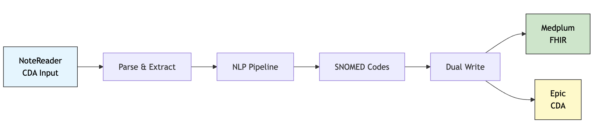
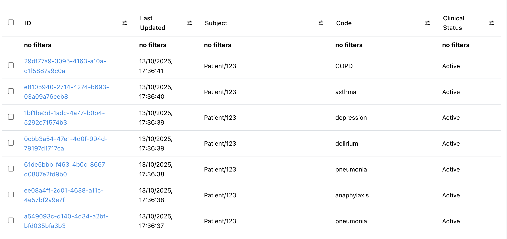
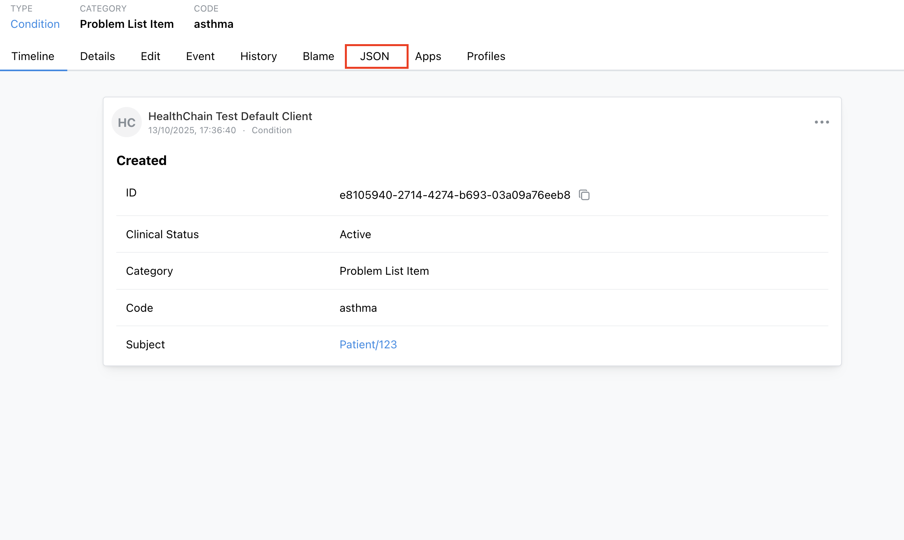

# Build a NoteReader Service with FHIR Integration

Modernize Epic NoteReader's legacy SOAP interface by connecting it to a modern FHIR server, without disrupting existing CDI workflows. You'll extract SNOMED CT codes from clinical notes using NLP, write structured data to [Medplum](https://www.medplum.com/) for analytics, and return CDA responses to Epic.

[Epic NoteReader CDI](../reference/gateway/soap_cda.md) is a legacy CDA interface for clinical documentation improvement workflows. It's great because it's already embedded in existing EHR workflows and designed for third-party NLP integrations. The downside? Its legacy SOAP design limits modern analytics in FHIR. This tutorial shows you how to bridge that gap. Get the best of both worlds! Legacy workflows keep running while you unlock advanced analytics.

Check out the full working example [here](https://github.com/dotimplement/HealthChain/tree/main/cookbook/notereader_clinical_coding_fhir.py).

## How It Works



A clinical note arrives from NoteReader as CDA XML → gets parsed and processed through scispacy → entities are linked to SNOMED CT codes → converted to FHIR Condition resources → written to both Medplum (modern FHIR) and back to Epic (legacy CDA).

## Setup

### Install Dependencies

We'll use [scispacy](https://allenai.github.io/scispacy/) for medical entity extraction. Install the required dependencies:

```bash
pip install healthchain scispacy python-dotenv
pip install https://s3-us-west-2.amazonaws.com/ai2-s2-scispacy/releases/v0.5.4/en_core_sci_sm-0.5.4.tar.gz
```

### Download Sample Data

Download the sample CDA file `notereader_cda.xml` into a `data/` folder in your project root using `wget`:

```bash
mkdir -p data
cd data
wget https://github.com/dotimplement/HealthChain/raw/main/cookbook/data/notereader_cda.xml
```

### Configure Medplum Credentials

Set up a Medplum account and obtain client credentials. See the [FHIR Sandbox Setup Guide](./setup_fhir_sandboxes.md#medplum) for detailed instructions.

Once you have your Medplum credentials, configure them in a `.env` file:

```bash
# .env file
MEDPLUM_BASE_URL=https://api.medplum.com/fhir/R4
MEDPLUM_CLIENT_ID=your_client_id
MEDPLUM_CLIENT_SECRET=your_client_secret
MEDPLUM_TOKEN_URL=https://api.medplum.com/oauth2/token
MEDPLUM_SCOPE=openid
```

## Add the CDA Adapter

First we'll need to convert the incoming CDA XML to FHIR. The [CdaAdapter](../reference/io/adapters/cdaadapter.md) enables round-trip conversion between CDA and FHIR using the [InteropEngine](../reference/interop/engine.md) for seamless legacy-to-modern data integration.


```python
from healthchain.io import CdaAdapter
from healthchain.engine import create_interop

# Create an interop engine with default configuration
interop_engine = create_interop()
cda_adapter = CdaAdapter(engine=interop_engine)

# Parse the CDA document to a Document object
doc = cda_adapter.parse(request)

# Access list of Condition resources in problem_list accessor
doc.fhir.problem_list

# Format the Document object back to a CDA document
response = cda_adapter.format(doc)
```

!!! info "What this adapter does"

    - Parses CDA XML documents and extracts clinical text and coded data
    - Stores text data in `doc.text`
    - Stores CDA XML as a [DocumentReference](https://www.hl7.org/fhir/documentreference.html) resource in `doc.fhir.bundle`
    - Stores extracted [Condition](https://www.hl7.org/fhir/condition.html) resources in `doc.fhir.problem_list`


## Initialize the Pipeline

Next we'll build our NLP processing pipeline. We'll use a [MedicalCodingPipeline](../reference/pipeline/pipeline.md), which will run your specified NLP model on extracted text data out-of-the-box. To link extracted entities (e.g., "chronic kidney disease", "asthma") to standard clinical codes (e.g. SNOMED CT, ICD-10), we'll add a custom node to handle this.

For this demo, we'll use a simple dictionary for the SNOMED CT mapping.

```python
from healthchain.pipeline.medicalcodingpipeline import MedicalCodingPipeline
from healthchain.io import Document
from spacy.tokens import Span

# Build FHIR-native ML pipeline with automatic problem extraction.
pipeline = MedicalCodingPipeline.from_model_id("en_core_sci_sm", source="spacy")

# Add custom entity linking
@pipeline.add_node(position="after", reference="SpacyNLP")
def link_entities(doc: Document) -> Document:
    """
    Add CUI codes to medical entities for problem extraction.
    """
    if not Span.has_extension("cui"):
        Span.set_extension("cui", default=None)

    spacy_doc = doc.nlp.get_spacy_doc()

    # Dummy medical concept mapping to SNOMED CT codes
    medical_concepts = {
        "pneumonia": "233604007",
        "type 2 diabetes mellitus": "44054006",
        "congestive heart failure": "42343007",
        "chronic kidney disease": "431855005",
        "hypertension": "38341003",
        # Add more mappings as needed
    }

    for ent in spacy_doc.ents:
        if ent.text.lower() in medical_concepts:
            # Store as custom spacy attribute 'cui'
            ent._.cui = medical_concepts[ent.text.lower()]

    return doc
```

!!! note
    [MedicalCodingPipeline](../reference/pipeline/pipeline.md) automatically:

    - Extracts medical entities using the `scispacy` model
    - Converts NLP entities to FHIR `problem-list-item` [Condition](https://www.hl7.org/fhir/condition.html) resources

    This is equivalent to constructing a pipeline with the following components manually:

    ```python
    from healthchain.pipeline import Pipeline
    from healthchain.pipeline.components import SpacyNLP, FHIRProblemListExtractor
    from healthchain.io import Document

    pipeline = Pipeline[Document]()

    pipeline.add_node(SpacyNLP.from_model_id("en_core_sci_sm"))
    pipeline.add_node(FHIRProblemListExtractor())
    ```


## Set up FHIR Gateway

[FHIR Gateways](../reference/gateway/fhir_gateway.md) enable your app to connect to one or more external FHIR servers (like EHRs, registries, billing systems).

Use `.add_source` to register a FHIR endpoint you want to connect to with its connection string; the gateway will automatically manage the authentication and routing.

```python
from healthchain.gateway import FHIRGateway
from healthchain.gateway.clients.fhir.base import FHIRAuthConfig
from dotenv import load_dotenv

load_dotenv()

# Load configuration from environment variables
config = FHIRAuthConfig.from_env("MEDPLUM")
MEDPLUM_URL = config.to_connection_string()

# Initialize FHIR gateway and register external systems
fhir_gateway = FHIRGateway()
fhir_gateway.add_source("medplum", MEDPLUM_URL)

# You can add multiple FHIR sources:
# fhir_gateway.add_source("ehr", "fhir://epic.example.com/fhir/R4/")
# fhir_gateway.add_source("registry", "fhir://registry.example.com/fhir/R4/")
```

## Set Up the NoteReader Service

Now let's set up the handler for [NoteReaderService](../reference/gateway/soap_cda.md) method `ProcessDocument`, which will be called by Epic NoteReader when it is triggered in the CDI workflow. This is where we will combine all our components: adapter, pipeline, and writing to our configured FHIR endpoint:

```python
from healthchain.gateway import NoteReaderService

# Create the NoteReader service
note_service = NoteReaderService()

@note_service.method("ProcessDocument")
def ai_coding_workflow(request: CdaRequest):
    # Parse CDA document from legacy system
    doc = cda_adapter.parse(request)

    # Process through ML pipeline to extract medical entities
    doc = pipeline(doc)

    # Access the extracted FHIR resources
    for condition in doc.fhir.problem_list:
        # Add metadata for audit and provenance tracking
        condition = add_provenance_metadata(
            condition, source="epic-notereader", tag_code="cdi"
        )
        # Send to external FHIR server via gateway
        fhir_gateway.create(condition, source="billing")

    # Return processed CDA response to the legacy system
    cda_response = cda_adapter.format(doc)

    return cda_response
```

## Build the Service

Time to put it all together! Using [HealthChainAPI](../reference/gateway/api.md), we can create a service with *both* the FHIR and NoteReader endpoints:

```python
from healthchain.gateway import HealthChainAPI

# Register services with the API gateway
app = HealthChainAPI(title="Healthcare Integration Gateway")

app.register_gateway(fhir_gateway, path="/fhir")
app.register_service(note_service, path="/notereader")
```

## Test with Sample Documents

HealthChain provides a [sandbox client utility](../reference/utilities/sandbox.md) which simulates the NoteReader workflow end-to-end. It loads your sample CDA document, sends it to your service via the configured endpoint, and saves the request/response exchange in an `output/` directory. This lets you test the complete integration locally before connecting to Epic.

```python
from healthchain.sandbox import SandboxClient

# Create sandbox client for SOAP/CDA testing
client = SandboxClient(
    url="http://localhost:8000/notereader/ProcessDocument",
    workflow="sign-note-inpatient",
    protocol="soap"
)

# Load sample CDA document
client.load_from_path("./data/notereader_cda.xml")

# Inspect CDA document before sending
# for request in client.requests:
#     print(request.document[:1000])  # View first 1000 chars of CDA XML
```

## Run the Complete Example

Now for the moment of truth! Start your service and run the sandbox to see the complete workflow in action.

```python
import uvicorn
import threading

# Start the API server in a separate thread
def start_api():
    uvicorn.run(app, port=8000)

api_thread = threading.Thread(target=start_api, daemon=True)
api_thread.start()

# Send requests and save responses with sandbox client
client.send_requests()
client.save_results("./output/")
```

!!! abstract "What happens when you run this"

    1. **Service starts** – `HealthChainAPI` launches two endpoints:
        - `/notereader/ProcessDocument`: SOAP endpoint for processing CDA documents
        - `/fhir`: REST API endpoint for FHIR operations (optional, for testing)

    2. **Sandbox runs** – Your test CDA document is:
        - Wrapped in a SOAP envelope
        - Sent to `/notereader/ProcessDocument`

    3. **Artifacts** – Sandbox saves request/response XML files to the `output/` directory for inspection


### Expected Output

[Our sample data](https://github.com/dotimplement/HealthChain/raw/main/cookbook/data/notereader_cda.xml) contains the following note:

??? example "Test Note"
    ```text
    This 37 year old gentleman presented with a fever, cough and sore throat. He was diagnosed with a community acquired pneumonia, and started on co-amoxiclav. Unfortunately he developed anaphylaxis and was treated with resuscitation fluids and adrenaline but not hydrocortisone. He had refractory anaphylaxis and so was transferred to intensive care for intubation and ventilation. He then developed a "ventilation associated pneumonia", requiring meropenem. Once treated for his CAP and VAP he was stepped down to the ward. He was treated with haloperidol for a presumed 'delirium'. He improved medically, but deteriorated in terms of his psychiatric health, with depression, anxiety and paranoid schizophrenia. He was self-medicating with his own supply of Librium.

    He has a past medical history of asthma and COPD but not cirrhosis.

    He regularly takes penicillin, Ventolin and tiotropium inhalers, as well as an ACE inhibitor, beta blocker and calcium channel blocker.

    He is allergic to all opiates, including morphine.

    He has previously had a cholecystectomy and appendicectomy.

    Plan:
    - Discharge planning

    I reviewed the Resident's note and agree with the documented findings and plan of care.  The reason the patient is critically ill and the nature of the treatment and management provided by the teaching physician (me) to manage the critically ill patient is: as aove

    The patient was critically ill during the time that I saw the patient. The Critical Care Time excluding procedures was 6 minutes.
    ```

So you should expect to see the following conditions extracted, which we have linked to SNOMED CT codes in our processing pipeline:

| Condition      | SNOMED CT Code |
|:-------------- |:--------------:|
| pneumonia      | 233604007      |
| anaphylaxis    | 39579001       |
| delirium       | 2776000        |
| depression     | 35489007       |
| asthma         | 195967001      |
| COPD           | 13645005       |

#### Medplum Console

After running the example, go to Medplum to see your extracted conditions in action:

1. Log in to your [Medplum account](https://app.medplum.com)
2. Search and navigate to **Condition** resources in the search bar under the Medplum logo. You should see a list of all the Condition data you have in Medplum's FHIR server:




You should be able to interact with the resources you've just created in the Medplum web UI. Click on JSON to see the original data:



!!! example "Example output: Condition FHIR resource"
    ```json
    {
      "resourceType": "Condition",
      "id": "e8105940-2714-4274-b693-03a09a76eeb8",
      "meta": {
        "lastUpdated": "2025-10-13T16:36:40.435Z",
        "source": "urn:healthchain:source:epic-notereader",
        "tag": [
          {
            "system": "https://dotimplement.github.io/HealthChain/fhir/tags",
            "code": "cdi",
            "display": "cdi"
          }
        ],
        "versionId": "fd21c838-1fe6-45c9-84d7-00184338b8ee",
        "author": {
          "reference": "ClientApplication/01977d2b-244e-75ea-af98-0c35157e1a9b",
          "display": "HealthChain Test Default Client"
        },
        "project": "01977d2b-243b-7476-b9eb-81a5298febbc",
        "compartment": [
          {
            "reference": "Project/01977d2b-243b-7476-b9eb-81a5298febbc"
          }
        ]
      },
      "clinicalStatus": {
        "coding": [
          {
            "system": "http://terminology.hl7.org/CodeSystem/condition-clinical",
            "code": "active",
            "display": "Active"
          }
        ]
      },
      "category": [
        {
          "coding": [
            {
              "system": "http://terminology.hl7.org/CodeSystem/condition-category",
              "code": "problem-list-item",
              "display": "Problem List Item"
            }
          ]
        }
      ],
      "code": {
        "coding": [
          {
            "system": "http://snomed.info/sct",
            "code": "195967001",
            "display": "asthma"
          }
        ]
      },
      "subject": {
        "reference": "Patient/123"
      }
    }
    ```


#### `/output` Directory

Check that the extracted conditions also exist in the CDA response sent back to our simulated Epic backend:

??? example "response.xml"
    ```xml
    <ClinicalDocument xmlns="urn:hl7-org:v3">
        ...
        <component>
            <structuredBody>
                ...
                <entry>
                    <act>
                        ...
                        <code code="233604007" codeSystem="2.16.840.1.113883.6.96" codeSystemName="SNOMED CT" displayName="Pneumonia" />
                        ...
                    </act>
                </entry>
                <entry>
                    <act>
                        ...
                        <code code="39579001" codeSystem="2.16.840.1.113883.6.96" codeSystemName="SNOMED CT" displayName="Anaphylaxis" />
                        ...
                    </act>
                </entry>
                <entry>
                    <act>
                        ...
                        <code code="2776000" codeSystem="2.16.840.1.113883.6.96" codeSystemName="SNOMED CT" displayName="Delirium" />
                        ...
                    </act>
                </entry>
                <entry>
                    <act>
                        ...
                        <code code="35489007" codeSystem="2.16.840.1.113883.6.96" codeSystemName="SNOMED CT" displayName="Depressive disorder" />
                        ...
                    </act>
                </entry>
                <entry>
                    <act>
                        ...
                        <code code="195967001" codeSystem="2.16.840.1.113883.6.96" codeSystemName="SNOMED CT" displayName="Asthma" />
                        ...
                    </act>
                </entry>
                <entry>
                    <act>
                        ...
                        <code code="13645005" codeSystem="2.16.840.1.113883.6.96" codeSystemName="SNOMED CT" displayName="Chronic obstructive lung disease" />
                        ...
                    </act>
                </entry>
                ...
            </structuredBody>
        </component>
        ...
    </ClinicalDocument>
    ```
    *Lines with only problem/condition `code` elements are shown within their parent structure; `...` is used to indicate omitted sections for clarity and brevity.*

Your extracted diagnoses are now available as structured FHIR resources, ready for analytics, reporting, or downstream processing, while Epic continues receiving the original CDA responses!

## What You've Built

A clinical coding service that bridges legacy CDA systems with modern FHIR infrastructure:

- **Legacy system integration** - Processes CDA documents from Epic NoteReader workflows
- **AI-powered extraction** - Uses NLP to extract medical entities and map to SNOMED CT codes
- **FHIR interoperability** - Converts extracted conditions to FHIR resources and syncs with external servers
- **Audit trail** - Tracks provenance metadata for compliance and debugging
- **Dual interface** - Maintains CDA compatibility while enabling modern FHIR operations

!!! info "Use Cases"

    - **Clinical Documentation Improvement (CDI)**:
      Automatically extract billable conditions from clinical notes and populate problem lists in real-time during clinician workflows.

    - **Terminology Harmonization**:
      Bridge legacy ICD-9 systems with modern SNOMED CT standards by processing historical CDA documents and creating FHIR-compliant problem lists.

    - **Research Data Extraction**:
      Extract structured condition data from unstructured clinical notes for cohort building and retrospective studies.

!!! tip "Next Steps"

    - **Enhance entity linking**: Replace the dictionary lookup with terminology servers or entity linking models for comprehensive medical terminology coverage.
    - **Add validation**: Implement FHIR resource validation before sending to external servers.
    - **Expand to other workflows**: Adapt the pattern for lab results, medications, or radiology reports.
    - **Build on it**: Use the extracted conditions in the [Data Aggregation example](./multi_ehr_aggregation.md) to combine with other FHIR sources.
