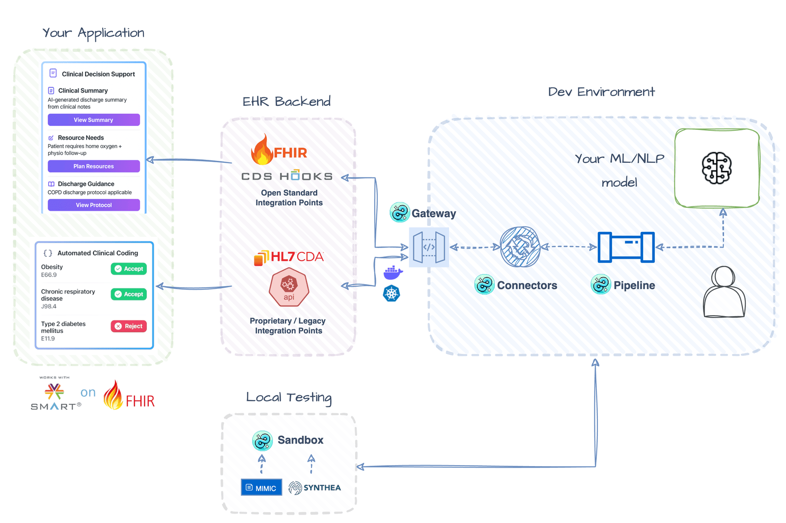

# Build a CDS Hooks Service for Discharge Summarization

This example shows you how to build a CDS service that integrates with EHR systems. We'll automatically summarize discharge notes and return actionable recommendations using the [CDS Hooks standard](https://cds-hooks.org/).

Check out the full working example [here](https://github.com/dotimplement/HealthChain/tree/main/cookbook/cds_discharge_summarizer_hf_chat.py)!

 *Illustrative Architecture - actual implementation may vary.*

## Setup

### Install Dependencies

```bash
pip install healthchain python-dotenv
```

This example uses a Hugging Face model for the summarization task, so make sure you have a [Hugging Face API token](https://huggingface.co/docs/hub/security-tokens) and set it as the `HUGGINGFACEHUB_API_TOKEN` environment variable.


If you are using a chat model, make sure you have the necessary `langchain` packages installed.

```bash
pip install langchain langchain-huggingface
```

### Download Sample Data

Download the sample data `discharge_notes.csv` into a `data/` folder in your project root using `wget`:

```bash
mkdir -p data
cd data
wget https://github.com/dotimplement/HealthChain/raw/main/cookbook/data/discharge_notes.csv
```

## Initialize the pipeline

First, we'll create a [summarization pipeline](../reference/pipeline/pipeline.md) with domain-specific prompting for discharge workflows. You can choose between:

- **Transformer models** fine-tuned for clinical summarization (like `google/pegasus-xsum`)
- **Large Language Models** with custom clinical prompting (like `zephyr-7b-beta`)

For LLM approaches, we'll use [LangChain](https://python.langchain.com/docs/integrations/chat/huggingface/) for better prompting.

=== "Non-chat model"
    ```python
    from healthchain.pipeline import SummarizationPipeline

    pipeline = SummarizationPipeline.from_model_id(
      "google/pegasus-xsum", source="huggingface", task="summarization"
      )
    ```


=== "Chat model"
    ```python
    from healthchain.pipeline import SummarizationPipeline

    from langchain_huggingface.llms import HuggingFaceEndpoint
    from langchain_huggingface import ChatHuggingFace
    from langchain_core.prompts import PromptTemplate
    from langchain_core.output_parsers import StrOutputParser

    hf = HuggingFaceEndpoint(
        repo_id="deepseek-ai/DeepSeek-R1-0528",
        task="text-generation",
        max_new_tokens=512,
        do_sample=False,
        repetition_penalty=1.03,
    )

    model = ChatHuggingFace(llm=hf)

    template = """
    You are a discharge planning assistant for hospital operations.
    Provide a concise, objective summary focusing on actionable items
    for care coordination, including appointments, medications, and
    follow-up instructions. Format as bullet points.\n'''{text}'''
    """
    prompt = PromptTemplate.from_template(template)

    chain = prompt | model | StrOutputParser()

    pipeline = SummarizationPipeline.load(chain, source="langchain")
    ```

The `SummarizationPipeline` automatically:

- Parses FHIR resources from CDS Hooks requests
- Extracts clinical text from discharge documents
- Formats outputs as CDS cards

## Add the CDS FHIR Adapter

The [CdsFhirAdapter](../reference/io/adapters/cdsfhiradapter.md) converts between CDS Hooks requests and HealthChain's [Document](../reference/io/containers/document.md) format. This makes it easy to work with FHIR data in CDS workflows.

```python
from healthchain.io import CdsFhirAdapter

cds_adapter = CdsFhirAdapter()

# Parse the CDS request to a Document object
cds_adapter.parse(request)

# Format the Document object back to a CDS response
cds_adapter.format(doc)
```

!!! info "What this adapter does"

    - Parses FHIR resources from CDS Hooks requests
    - Extracts text from [DocumentReference](https://www.hl7.org/fhir/documentreference.html) resources
    - Formats responses as CDS cards according to the CDS Hooks specification

## Set Up the CDS Hook Handler

Create the [CDS Hooks handler](../reference/gateway/cdshooks.md) to receive discharge note requests, run the AI summarization pipeline, and return results as CDS cards.

```python
from healthchain.gateway import CDSHooksService
from healthchain.models import CDSRequest, CDSResponse

# Initialize the CDS service
cds_service = CDSHooksService()

# Define the CDS service function
@cds_service.hook("encounter-discharge", id="discharge-summary")
def handle_discharge_summary(request: CDSRequest) -> CDSResponse:
    """Process discharge summaries with AI"""
    # Parse CDS request to internal Document format
    doc = cds_adapter.parse(request)

    # Process through AI pipeline
    processed_doc = pipeline(doc)

    # Format response with CDS cards
    response = cds_adapter.format(processed_doc)
    return response
```

## Build the Service

Register the CDS service with [HealthChainAPI](../reference/gateway/api.md) to create REST endpoints:

```python
from healthchain.gateway import HealthChainAPI

app = HealthChainAPI(title="Discharge Summary CDS Service")
app.register_service(cds_service)
```

## Test with Sample Data

HealthChain provides a [sandbox client utility](../reference/utilities/sandbox.md) which simulates the CDS hooks workflow end-to-end. It loads your sample free text data and formats it into CDS requests, sends it to your service, and saves the request/response exchange in an `output/` directory. This lets you test the complete integration locally and inspect the inputs and outputs before connecting to a real EHR instance.


```python
from healthchain.sandbox import SandboxClient

# Create sandbox client for testing
client = SandboxClient(
    url="http://localhost:8000/cds/cds-services/discharge-summarizer",
    workflow="encounter-discharge"
)

# Load discharge notes from CSV and generate FHIR data
client.load_free_text(
    csv_path="data/discharge_notes.csv",
    column_name="text"
)

# Inspect requests before sending to verify data
# for request in client.requests:
#     print(request.prefetch.get('document'))  # Get DocumentReference
```

!!! tip "Learn More About Test Data Generation"

    Read more about the test FHIR data generator for CDS hooks [here](../reference/utilities/data_generator.md)

## Run the Complete Example

Put it all together and run both the service and sandbox client:

```python
import uvicorn
import threading

# Start the API server in a separate thread
def start_api():
    uvicorn.run(app, port=8000)

api_thread = threading.Thread(target=start_api, daemon=True)
api_thread.start()

# Send requests and save responses with sandbox client
client.send_requests()
client.save_results("./output/")
```

!!! tip "Service Endpoints"

    Once running, your service will be available at:

    - **Service discovery**: `http://localhost:8000/cds-services`
    - **Discharge summary endpoint**: `http://localhost:8000/cds-services/discharge-summary`

??? example "Example CDS Response"

    ```json
    {
      "cards": [
        {
          "summary": "Discharge Transportation",
          "indicator": "info",
          "source": {
            "label": "HealthChain Discharge Assistant"
          },
          "detail": "• Transport arranged for 11:00 HRs\n• Requires bariatric ambulance and 2 crew members\n• Confirmation number: TR-2024-001"
        },
        {
          "summary": "Medication Management",
          "indicator": "warning",
          "source": {
            "label": "HealthChain Discharge Assistant"
          },
          "detail": "• Discharge medications: Apixaban 5mg, Baclofen 20mg MR\n• New anticoagulation card prepared\n• Collection by daughter scheduled"
        }
      ]
    }
    ```

## What You've Built

A CDS Hooks service for discharge workflows that integrates seamlessly with EHR systems:

- **Standards-compliant** - Implements the CDS Hooks specification for EHR interoperability
- **AI-powered summarization** - Processes discharge notes using transformer models or LLMs
- **Actionable recommendations** - Returns structured cards with discharge planning tasks
- **Flexible pipeline** - Supports both fine-tuned models and prompt-engineered LLMs
- **Auto-discovery** - Provides service discovery endpoint for EHR registration

!!! info "Use Cases"

    - **Discharge Planning Coordination**
      Automatically extract and highlight critical discharge tasks (appointments, medications, equipment needs) to reduce care coordination errors and readmissions.

    - **Clinical Decision Support**
      Provide real-time recommendations during discharge workflows, surfacing potential issues like medication interactions or missing follow-up appointments.

    - **Documentation Efficiency**
      Generate concise discharge summaries from lengthy clinical notes, saving clinicians time while ensuring all critical information is captured.

!!! tip "Next Steps"

    - **Enhance prompts**: Tune your clinical prompts to extract specific discharge criteria or care plan elements.
    - **Add validation**: Implement checks for required discharge elements (medications, follow-ups, equipment).
    - **Multi-card support**: Expand to generate separate cards for different discharge aspects (medication reconciliation, transportation, follow-up scheduling).
    - **Integrate with workflows**: Deploy to Epic App Orchard or Cerner Code Console for production EHR integration.
