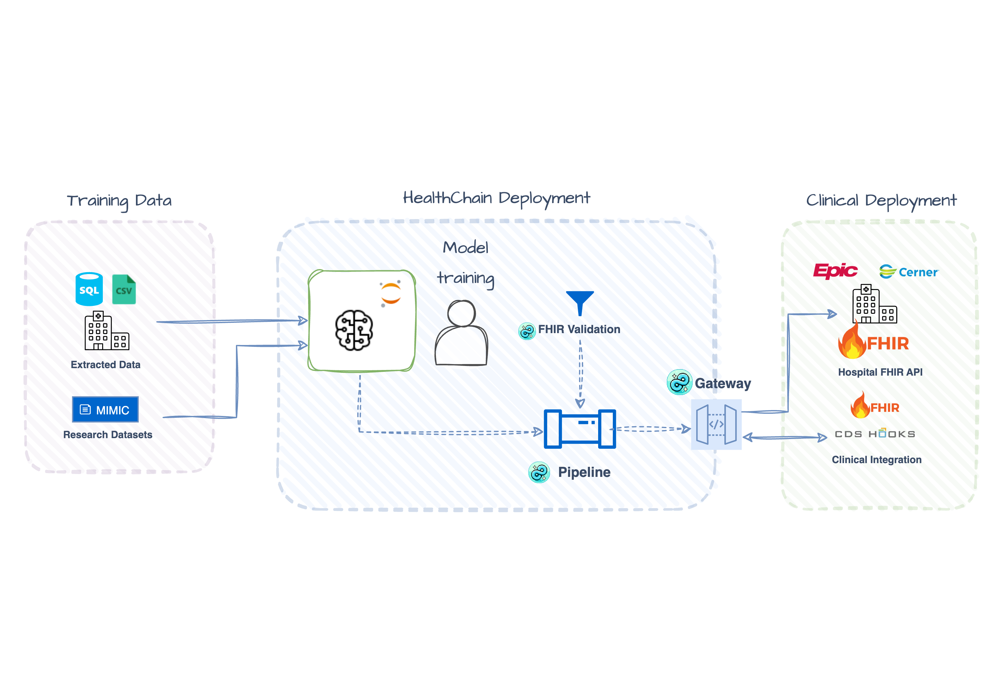

# Deploy ML Models: Real-Time Alerts & Batch Screening

You trained a model on CSVs. Now you need to deploy it against FHIR data from EHRs. This tutorial shows how to bridge that gap with two production patterns: **real-time CDS Hooks alerts** and **batch FHIR Gateway screening**—both using the same model and a simple YAML schema that maps FHIR resources to your training features.

Check out the full working examples:

- [Real-time CDS Hooks](https://github.com/dotimplement/HealthChain/tree/main/cookbook/sepsis_cds_hooks.py)
- [Batch FHIR Gateway](https://github.com/dotimplement/HealthChain/tree/main/cookbook/sepsis_fhir_batch.py)



## When to Use Each Pattern

| Pattern | Trigger | Output | Best For |
|---------|---------|--------|----------|
| **CDS Hooks** | Clinician opens chart | Alert cards in EHR UI | Point-of-care decision support |
| **FHIR Gateway** | Scheduled job / API call | [RiskAssessment](https://www.hl7.org/fhir/riskassessment.html) resources | Population screening, quality measures |

Both patterns share the same trained model and feature extraction—only the integration layer differs.

## Setup

### Install Dependencies

```bash
pip install healthchain joblib xgboost scikit-learn python-dotenv
```

### Train the Model (or Bring Your Own)

The cookbook includes a training script that builds an XGBoost classifier from MIMIC-IV data. From the project root:

```bash
cd scripts
python sepsis_prediction_training.py
```

This script:

- Loads MIMIC-IV CSV tables (chartevents, labevents, patients, diagnoses)
- Extracts vitals features (heart rate, temperature, respiratory rate, WBC, lactate, creatinine, age, gender)
- Labels ICU stays with sepsis diagnoses (ICD-9/ICD-10)
- Trains Random Forest, XGBoost, and Logistic Regression models
- Saves the best model (by F1 score) to `scripts/models/sepsis_model.pkl`

After training, copy the model to the cookbook directory:

```bash
cp scripts/models/sepsis_model.pkl cookbook/models/
```

!!! note "MIMIC-IV Demo Dataset"

    The training script uses the [MIMIC-IV Clinical Database Demo](https://physionet.org/content/mimic-iv-demo/2.2/) (~50MB, freely downloadable). Set the path:

    ```bash
    export MIMIC_CSV_PATH=/path/to/mimic-iv-clinical-database-demo-2.2
    ```

    *This is a quick-start workflow for demo purposes. Full MIMIC requires credentialed access. Most researchers use BigQuery or a PostgreSQL database.

**Using your own model?** The pipeline is flexible—just save any scikit-learn-compatible model as a pickle with this structure:

```python
import joblib

model_data = {
    "model": your_trained_model,  # Must have .predict_proba()
    "metadata": {
        "feature_names": ["heart_rate", "temperature", ...],
        "metrics": {"optimal_threshold": 0.5}
    }
}
joblib.dump(model_data, "cookbook/models/sepsis_model.pkl")
```

The pipeline will work with any model that implements `predict_proba()` - XGBoost, Random Forest, LightGBM, or even PyTorch/TensorFlow models wrapped with a sklearn-compatible interface.

### Prepare Demo Patient Data

The two patterns have different data requirements:

| Pattern | Data Source | What You Need |
|---------|-------------|---------------|
| **CDS Hooks** | Local JSON files | Download pre-extracted patients (quick start) |
| **FHIR Gateway** | FHIR server | Upload patients to Medplum and get server-assigned IDs |

=== "CDS Hooks Only (Quick Start)"

    Download pre-extracted patient bundles—these are already in the repo if you cloned it:

    ```bash
    mkdir -p cookbook/data/mimic_demo_patients
    cd cookbook/data/mimic_demo_patients
    wget https://github.com/dotimplement/HealthChain/raw/main/cookbook/data/mimic_demo_patients/high_risk_patient.json
    wget https://github.com/dotimplement/HealthChain/raw/main/cookbook/data/mimic_demo_patients/moderate_risk_patient.json
    wget https://github.com/dotimplement/HealthChain/raw/main/cookbook/data/mimic_demo_patients/low_risk_patient.json
    ```

    That's it! Skip to [Pattern 1: CDS Hooks](#pattern-1-real-time-cds-hooks-alerts).

=== "FHIR Gateway (Full Setup)"

    The batch screening pattern queries patients from a FHIR server. This tutorial uses [Medplum](https://www.medplum.com/) (a free, hosted FHIR server), but any FHIR R4-compliant API works - just swap the credentials.

    **1. Configure FHIR Credentials**

    Add Medplum credentials to your `.env` file. See [FHIR Sandbox Setup](./setup_fhir_sandboxes.md#medplum) for details:

    ```bash
    MEDPLUM_BASE_URL=https://api.medplum.com/fhir/R4
    MEDPLUM_CLIENT_ID=your_client_id
    MEDPLUM_CLIENT_SECRET=your_client_secret
    MEDPLUM_TOKEN_URL=https://api.medplum.com/oauth2/token
    MEDPLUM_SCOPE=openid
    ```

    **2. Extract and Upload Demo Patients**

    ```bash
    # Set MIMIC-on-FHIR path (or use --mimic flag)
    export MIMIC_FHIR_PATH=/path/to/mimic-iv-on-fhir

    # Extract and upload to Medplum
    cd scripts
    python extract_mimic_demo_patients.py --minimal --upload
    ```

    This script:

    - Loads patient data from [MIMIC-IV on FHIR](https://physionet.org/content/mimic-iv-demo/2.2/)
    - Runs the sepsis model to find high/moderate/low risk patients
    - Creates minimal FHIR bundles with only the observations needed
    - Uploads them to your Medplum instance as transaction bundles

    **3. Copy Patient IDs**

    After upload, the script prints server-assigned patient IDs:

    ```
    ✓ Uploaded to Medplum!

    Copy this into sepsis_fhir_batch.py:

    DEMO_PATIENT_IDS = [
        "702e11e8-6d21-41dd-9b48-31715fdc0fb1",  # high risk
        "3b0da7e9-0379-455a-8d35-bedd3a6ee459",  # moderate risk
        "f490ceb4-6262-4f1e-8b72-5515e6c46741",  # low risk
    ]
    ```

    Copy these IDs into the `DEMO_PATIENT_IDS` list in `sepsis_fhir_batch.py`.

    !!! tip "Generate More Patients"

        The script has options for generating larger test sets:

        ```bash
        python extract_mimic_demo_patients.py --help

        # Examples:
        --num-patients-per-risk 5   # 5 patients per risk level (15 total)
        --seed 123                   # Different random sample
        --minimal                    # Keep only latest observation per feature (~12KB each)
        ```

    !!! tip "Alternative: Manual Upload"

        If you prefer, run without `--upload` to generate bundle JSON files, then upload them manually via the [Medplum → Batch](https://app.medplum.com/batch) page.

---

**Setup complete!** You should now have:

- ✅ A trained model at `cookbook/models/sepsis_model.pkl`
- ✅ Demo patient data (local JSON or uploaded to Medplum)

If using the **FHIR Gateway pattern**, also confirm:

- ✅ FHIR credentials in `.env`
- ✅ Patient IDs copied into `DEMO_PATIENT_IDS` in `sepsis_fhir_batch.py`

## The Shared Model Pipeline

Both patterns reuse the same pipeline. Here's what you'll write:

```python
def create_pipeline() -> Pipeline[Dataset]:
    pipeline = Pipeline[Dataset]()

    @pipeline.add_node
    def impute_missing(dataset: Dataset) -> Dataset:
        dataset.data = dataset.data.fillna(dataset.data.median(numeric_only=True))
        return dataset

    @pipeline.add_node
    def run_inference(dataset: Dataset) -> Dataset:
        features = dataset.data[feature_names]
        probabilities = model.predict_proba(features)[:, 1]
        dataset.metadata["probabilities"] = probabilities
        return dataset

    return pipeline
```

The pipeline operates on a `Dataset`, which you create from a FHIR bundle:

```python
dataset = Dataset.from_fhir_bundle(bundle, schema=SCHEMA_PATH)
```

**How does FHIR become a DataFrame?** The schema maps FHIR resources to your training features:

```yaml
# sepsis_vitals.yaml (excerpt)
features:
  heart_rate:
    fhir_resource: Observation
    code: "220045"  # MIMIC chartevents code
  wbc:
    fhir_resource: Observation
    code: "51301"   # MIMIC labevents code
  age:
    fhir_resource: Patient
    field: birthDate
    transform: calculate_age
```

No FHIR parsing code needed—define the mapping once, use it everywhere.

!!! tip "Explore Interactively"

    Step through the full flow in [notebooks/fhir_ml_workflow.ipynb](https://github.com/dotimplement/HealthChain/blob/main/notebooks/fhir_ml_workflow.ipynb): FHIR bundle → Dataset → DataFrame → inference → RiskAssessment.

Now let's see how this pipeline plugs into each deployment pattern.

---

## Pattern 1: Real-Time CDS Hooks Alerts

Use CDS Hooks when you need **instant alerts** during clinical workflows. The EHR triggers your service and pushes patient data via prefetch—no server queries needed.

### How It Works

```
Clinician opens chart → EHR fires patient-view hook → Your service runs prediction → CDS card appears in EHR
```

### Set Up the CDS Hook Handler

Create a [CDSHooksService](../reference/gateway/cdshooks.md) that listens for `patient-view` events:

```python
from healthchain.gateway import CDSHooksService
from healthchain.fhir import prefetch_to_bundle
from healthchain.models import CDSRequest, CDSResponse
from healthchain.models.responses.cdsresponse import Card

cds = CDSHooksService()

@cds.hook("patient-view", id="sepsis-risk")
def sepsis_alert(request: CDSRequest) -> CDSResponse:
    if not request.prefetch:
        return CDSResponse(cards=[])

    # FHIR prefetch → Dataset → Prediction
    bundle = prefetch_to_bundle(request.prefetch)
    dataset = Dataset.from_fhir_bundle(bundle, schema=SCHEMA_PATH)
    result = pipeline(dataset)

    # Generate alert card if risk is elevated
    prob = float(result.metadata["probabilities"][0])
    risk = "high" if prob > 0.7 else "moderate" if prob > 0.4 else "low"

    if risk in ["high", "moderate"]:
        return CDSResponse(cards=[
            Card(
                summary=f"Sepsis Risk: {risk.upper()} ({prob:.0%})",
                indicator="critical" if risk == "high" else "warning",
                detail=f"Predicted sepsis risk: {risk.upper()}. Recommend workup.",
                source={"label": "HealthChain Sepsis Predictor"},
            )
        ])

    return CDSResponse(cards=[])
```

### Build the Service

Register with [HealthChainAPI](../reference/gateway/api.md):

```python
app = HealthChainAPI(title="Sepsis CDS Hooks")
app.register_service(cds, path="/cds")
```

### Test with Sandbox Client

The [SandboxClient](../reference/utilities/sandbox.md) simulates EHR requests using your demo patient files:

```python
from healthchain.sandbox import SandboxClient

client = SandboxClient(
    url="http://localhost:8000/cds/cds-services/sepsis-risk",
    workflow="patient-view",
)
client.load_from_path("data/mimic_demo_patients", pattern="*_patient.json")
responses = client.send_requests()
client.save_results(save_request=True, save_response=True, directory="./output/")
```

### Expected Output

```
Processed 3 requests
  Patient 1: Sepsis Risk: HIGH (85%)
  Patient 2: Sepsis Risk: MODERATE (52%)
  Patient 3: Low risk (no alert)
```

??? example "Example CDS Response"

    ```json
    {
      "cards": [
        {
          "summary": "Sepsis Risk: HIGH (85%)",
          "indicator": "critical",
          "source": {
            "label": "HealthChain Sepsis Predictor",
            "url": "https://www.sccm.org/SurvivingSepsisCampaign/Guidelines/Adult-Patients"
          },
          "detail": "**AI Guidance:**\n- Predicted risk: **HIGH** (85%)\n- Recommend sepsis workup and early intervention.",
          "title": "Sepsis Alert (AI Prediction)"
        }
      ]
    }
    ```

---

## Pattern 2: Batch FHIR Gateway Screening

Use the FHIR Gateway when you need to **screen multiple patients** from a FHIR server. Unlike CDS Hooks (ephemeral alerts), this pattern **persists predictions back to the FHIR server** as RiskAssessment resources, making them available for dashboards, reports, and downstream workflows.

### How It Works

```
Query patients from FHIR server → Run predictions → Write RiskAssessment back to FHIR server
```

### Set Up FHIR Gateway

Configure the [FHIRGateway](../reference/gateway/fhir_gateway.md) with your FHIR source:

```python
from fhir.resources.patient import Patient
from fhir.resources.observation import Observation
from healthchain.gateway import FHIRGateway
from healthchain.gateway.clients.fhir.base import FHIRAuthConfig
from healthchain.fhir import merge_bundles

gateway = FHIRGateway()
config = FHIRAuthConfig.from_env("MEDPLUM")
gateway.add_source("medplum", config.to_connection_string())
```

### Screen Individual Patients

Query patient data, run prediction, and write back a [RiskAssessment](https://www.hl7.org/fhir/riskassessment.html) resource:

```python
def screen_patient(gateway: FHIRGateway, patient_id: str, source: str):
    # Query patient + observations from FHIR server
    patient_bundle = gateway.search(Patient, {"_id": patient_id}, source)
    obs_bundle = gateway.search(Observation, {"patient": patient_id}, source)
    bundle = merge_bundles([patient_bundle, obs_bundle])

    # FHIR → Dataset → Prediction
    dataset = Dataset.from_fhir_bundle(bundle, schema=SCHEMA_PATH)
    result = pipeline(dataset)

    # Convert to RiskAssessment and write back
    for ra in result.to_risk_assessment(
        outcome_code="A41.9",
        outcome_display="Sepsis",
        model_name="sepsis_xgboost_v1",
    ):
        gateway.create(ra, source=source)
```

### Batch Screen Multiple Patients

Loop over patient IDs and screen each one:

```python
for patient_id in patient_ids:
    screen_patient(gateway, patient_id, source="medplum")
```

!!! note "Demo vs Production"

    This demo uses a fixed list of patient IDs. In production, you'd query for patients dynamically—for example, ICU admissions in the last hour:

    ```python
    # Find patients with recent ICU encounters
    encounters = gateway.search(
        Encounter,
        {
            "class": "IMP",  # inpatient
            "location": "icu",
            "date": "ge2024-01-01",
        },
        source="ehr"
    )
    patient_ids = [e.subject.reference.split("/")[1] for e in encounters]
    ```

### Build the Service

```python
app = HealthChainAPI(title="Sepsis Batch Screening")
app.register_gateway(gateway, path="/fhir")
```

### Expected Output

After uploading demo patients to Medplum and running batch screening:

```
=== Screening patients from Medplum ===
  702e11e8-6d21-41dd-9b48-31715fdc0fb1: HIGH (85%) → RiskAssessment/abc123
  3b0da7e9-0379-455a-8d35-bedd3a6ee459: MODERATE (52%) → RiskAssessment/def456
  f490ceb4-6262-4f1e-8b72-5515e6c46741: LOW (15%) → RiskAssessment/ghi789
```
You should be able to see the RiskAssessment resources in the [Medplum console](https://app.medplum.com) (search for "RiskAssessment" in "Resource Type" search bar in top left corner)

??? example "Example RiskAssessment Resource"

    ```json
    {
      "resourceType": "RiskAssessment",
      "id": "abc123",
      "status": "final",
      "subject": {
        "reference": "Patient/702e11e8-6d21-41dd-9b48-31715fdc0fb1"
      },
      "method": {
        "coding": [{
          "system": "https://healthchain.io/models",
          "code": "sepsis_xgboost_v1",
          "display": "Sepsis XGBoost Model v1"
        }]
      },
      "prediction": [{
        "outcome": {
          "coding": [{
            "system": "http://hl7.org/fhir/sid/icd-10",
            "code": "A41.9",
            "display": "Sepsis"
          }]
        },
        "probabilityDecimal": 0.85,
        "qualitativeRisk": {
          "coding": [{
            "system": "http://terminology.hl7.org/CodeSystem/risk-probability",
            "code": "high",
            "display": "High likelihood"
          }]
        }
      }]
    }
    ```

---

## What You've Built

Two deployment patterns for the same ML model:

| | CDS Hooks | FHIR Gateway |
|-|-----------|--------------|
| **Integration** | Event-driven (EHR pushes data) | Pull-based (service queries server) |
| **Latency** | Real-time (<1s) | Batch (seconds to minutes) |
| **Output** | CDS Cards (ephemeral alerts) | RiskAssessment (persisted resources) |
| **Scaling** | Per-patient on demand | Parallel/scheduled batch jobs |

Both patterns:

- **Share the same model** - Train once, deploy multiple ways
- **Use YAML feature schemas** - Declarative FHIR → features mapping
- **Handle FHIR natively** - No custom data wrangling per integration

!!! info "Use Cases"

    **CDS Hooks (Real-time)**

    - Sepsis early warning alerts when opening ICU patient charts
    - Drug interaction warnings during medication ordering
    - Clinical guideline reminders triggered by diagnosis codes

    **FHIR Gateway (Batch)**

    - Nightly population health screening
    - Quality measure calculation for reporting
    - Research cohort identification
    - Pre-visit risk stratification

!!! tip "Next Steps"

    - **Train your own model**: Replace `sepsis_model.pkl` with your model; update the feature schema to match
    - **Add more features**: Extend `sepsis_vitals.yaml` with lab values, medications, or other Observations
    - **Add more FHIR sources**: The gateway supports multiple sources—see the cookbook script for Epic sandbox configuration, or the [FHIR Sandbox Setup guide](./setup_fhir_sandboxes.md)
    - **Automate batch runs**: Schedule screening jobs with cron, Airflow, or cloud schedulers; or use [FHIR Subscriptions](https://www.hl7.org/fhir/subscription.html) to trigger on new ICU admissions ([PRs welcome!](https://github.com/dotimplement/HealthChain/pulls))
    - **Combine patterns**: Use batch screening to identify high-risk patients, then enable CDS
    alerts for those patients
