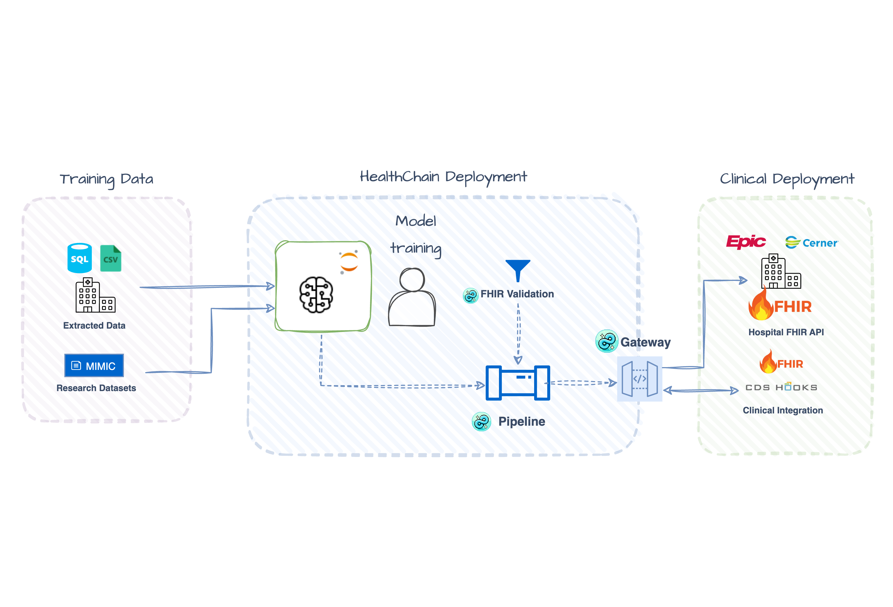

# Deploy ML Models: Real-Time Alerts & Batch Screening

**Level:** Intermediate

You trained a model on CSVs. Now you need to deploy it against FHIR data from EHRs. This tutorial shows how to bridge that gap with two production patterns: **real-time CDS Hooks alerts** and **batch FHIR Gateway screening** — both using the same model and a simple YAML schema that maps FHIR resources to your training features.

Check out the full working examples:

- [Real-time CDS Hooks](https://github.com/dotimplement/HealthChain/tree/main/cookbook/sepsis_cds_hooks.py)
- [Batch FHIR Gateway](https://github.com/dotimplement/HealthChain/tree/main/cookbook/sepsis_fhir_batch.py)



## When to Use Each Pattern

| Pattern | Trigger | Output | Best For |
|---------|---------|--------|----------|
| **CDS Hooks** | Clinician opens chart | Alert cards in EHR UI | Point-of-care decision support |
| **FHIR Gateway** | Scheduled job / API call | [RiskAssessment](https://www.hl7.org/fhir/riskassessment.html) resources | Population screening, quality measures |

Both patterns share the same trained model and feature extraction — only the integration layer differs.

---

## Quick Start: CDS Hooks in 5 Minutes

The demo patients and a pre-generated model are already in the repo — no training or data download needed.

```bash
pip install healthchain joblib xgboost
python cookbook/sepsis_cds_hooks.py
```

That's it. The script starts a local CDS Hooks service, fires test requests against it using three pre-extracted MIMIC patients, and prints risk scores:

```
Processed 3 requests
  Patient 1: Sepsis Risk: HIGH (85%)
  Patient 2: Sepsis Risk: MODERATE (52%)
  Patient 3: Low risk (no alert)
```

Results are saved to `./output/`. The rest of this tutorial explains how it works and how to adapt it.

---

## The Shared Model Pipeline

Both patterns reuse the same pipeline. It loads a pre-trained XGBoost classifier and runs inference on a `Dataset` extracted from a FHIR Bundle:

```python
def create_pipeline() -> Pipeline[Dataset]:
    pipeline = Pipeline[Dataset]()

    @pipeline.add_node
    def impute_missing(dataset: Dataset) -> Dataset:
        dataset.data = dataset.data.fillna(dataset.data.median(numeric_only=True))
        return dataset

    @pipeline.add_node
    def run_inference(dataset: Dataset) -> Dataset:
        features = dataset.data[feature_names]
        probabilities = model.predict_proba(features)[:, 1]
        dataset.metadata["probabilities"] = probabilities
        return dataset

    return pipeline
```

**How does FHIR become a DataFrame?** A YAML schema maps FHIR resources to your training features:

```yaml
# sepsis_vitals.yaml (excerpt)
features:
  heart_rate:
    fhir_resource: Observation
    code: "220045"  # MIMIC chartevents code
  wbc:
    fhir_resource: Observation
    code: "51301"   # MIMIC labevents code
  age:
    fhir_resource: Patient
    field: birthDate
    transform: calculate_age
```

No FHIR parsing code needed — define the mapping once, use it everywhere:

```python
dataset = Dataset.from_fhir_bundle(bundle, schema=SCHEMA_PATH)
```

!!! tip "Explore Interactively"

    Step through the full flow in [notebooks/fhir_ml_workflow.ipynb](https://github.com/dotimplement/HealthChain/blob/main/notebooks/fhir_ml_workflow.ipynb): FHIR bundle → Dataset → DataFrame → inference → RiskAssessment.

??? details "Bring your own model"

    The pre-generated model in `cookbook/models/` is a synthetic demo — not trained on real patient data. To swap in your own:

    ```python
    import joblib

    joblib.dump({
        "model": your_trained_model,    # any model with .predict_proba()
        "metadata": {
            "feature_names": ["heart_rate", "temperature", ...],
            "metrics": {"optimal_threshold": 0.5}
        }
    }, "cookbook/models/sepsis_model.pkl")
    ```

    Works with any scikit-learn-compatible model: XGBoost, LightGBM, or PyTorch/TF wrapped with a sklearn interface. To train on real MIMIC-IV data, see [`scripts/sepsis_prediction_training.py`](https://github.com/dotimplement/HealthChain/blob/main/scripts/sepsis_prediction_training.py).

---

## Pattern 1: Real-Time CDS Hooks Alerts

Use CDS Hooks when you need **instant alerts** during clinical workflows. The EHR triggers your service and pushes patient data via prefetch — no server queries needed.

```
Clinician opens chart → EHR fires patient-view hook → Your service runs prediction → CDS card appears in EHR
```

### Set Up the CDS Hook Handler

Create a [CDSHooksService](../reference/gateway/cdshooks.md) that listens for `patient-view` events:

```python
from healthchain.gateway import CDSHooksService
from healthchain.fhir import prefetch_to_bundle
from healthchain.models import CDSRequest, CDSResponse
from healthchain.models.responses.cdsresponse import Card

cds = CDSHooksService()

@cds.hook("patient-view", id="sepsis-risk")
def sepsis_alert(request: CDSRequest) -> CDSResponse:
    if not request.prefetch:
        return CDSResponse(cards=[])

    # FHIR prefetch → Dataset → Prediction
    bundle = prefetch_to_bundle(request.prefetch)
    dataset = Dataset.from_fhir_bundle(bundle, schema=SCHEMA_PATH)
    result = pipeline(dataset)

    prob = float(result.metadata["probabilities"][0])
    risk = "high" if prob > 0.7 else "moderate" if prob > 0.4 else "low"

    if risk in ["high", "moderate"]:
        return CDSResponse(cards=[
            Card(
                summary=f"Sepsis Risk: {risk.upper()} ({prob:.0%})",
                indicator="critical" if risk == "high" else "warning",
                detail=f"Predicted sepsis risk: {risk.upper()}. Recommend workup.",
                source={"label": "HealthChain Sepsis Predictor"},
            )
        ])

    return CDSResponse(cards=[])
```

### Build and Test the Service

Register with [HealthChainAPI](../reference/gateway/api.md) and test using the [SandboxClient](../reference/utilities/sandbox.md):

```python
from healthchain.gateway import HealthChainAPI

app = HealthChainAPI(title="Sepsis CDS Hooks")
app.register_service(cds, path="/cds")

with app.sandbox("sepsis-risk") as client:
    client.load_from_path("cookbook/data/mimic_demo_patients", pattern="*_patient.json")
    responses = client.send_requests()
    client.save_results("./output/")
```

??? example "Example CDS Response"

    ```json
    {
      "cards": [
        {
          "summary": "Sepsis Risk: HIGH (85%)",
          "indicator": "critical",
          "source": {
            "label": "HealthChain Sepsis Predictor",
            "url": "https://www.sccm.org/SurvivingSepsisCampaign/Guidelines/Adult-Patients"
          },
          "detail": "**AI Guidance:**\n- Predicted risk: **HIGH** (85%)\n- Recommend sepsis workup and early intervention.",
          "title": "Sepsis Alert (AI Prediction)"
        }
      ]
    }
    ```

---

## Advanced: Batch FHIR Gateway Screening

Use the FHIR Gateway when you need to **screen multiple patients** from a FHIR server. Unlike CDS Hooks (ephemeral alerts), this pattern **persists predictions back to the FHIR server** as RiskAssessment resources, making them available for dashboards, reports, and downstream workflows.

```
Query patients from FHIR server → Run predictions → Write RiskAssessment back to FHIR server
```

**Prerequisites:** A running FHIR server with patient data. This tutorial uses [Medplum](https://www.medplum.com/) — see the [FHIR Sandbox Setup guide](./setup_fhir_sandboxes.md#medplum) to get credentials, then add them to `.env`:

```bash
MEDPLUM_BASE_URL=https://api.medplum.com/fhir/R4
MEDPLUM_CLIENT_ID=your_client_id
MEDPLUM_CLIENT_SECRET=your_client_secret
MEDPLUM_TOKEN_URL=https://api.medplum.com/oauth2/token
```

??? details "Upload demo patients to Medplum"

    Pre-extracted MIMIC demo patients are already in the repo. Upload them to your Medplum instance with:

    ```bash
    healthchain seed medplum ./cookbook/data/mimic_demo_patients/
    ```

    The command prints the server-assigned IDs — copy them into `DEMO_PATIENT_IDS` in `sepsis_fhir_batch.py`:

    ```
    ✓ high_risk_bundle   →  PATIENT_ID=702e11e8-...
    ✓ low_risk_bundle    →  PATIENT_ID=3b0da7e9-...
    ✓ moderate_risk_bundle  →  PATIENT_ID=f490ceb4-...
    ```

    To regenerate patients from a full MIMIC-on-FHIR dataset: `python scripts/extract_mimic_demo_patients.py --minimal`.

### Screen Patients and Write Back Results

Configure the [FHIRGateway](../reference/gateway/fhir_gateway.md), run predictions, and write [RiskAssessment](https://www.hl7.org/fhir/riskassessment.html) resources back to the server:

```python
from healthchain.gateway import FHIRGateway
from healthchain.gateway.clients.fhir.base import FHIRAuthConfig
from healthchain.fhir.r4b import Patient, Observation
from healthchain.fhir import merge_bundles

gateway = FHIRGateway()
gateway.add_source("medplum", FHIRAuthConfig.from_env("MEDPLUM").to_connection_string())

def screen_patient(patient_id: str):
    patient_bundle = gateway.search(Patient, {"_id": patient_id}, "medplum")
    obs_bundle = gateway.search(Observation, {"patient": patient_id}, "medplum")
    bundle = merge_bundles([patient_bundle, obs_bundle])

    dataset = Dataset.from_fhir_bundle(bundle, schema=SCHEMA_PATH)
    result = pipeline(dataset)

    for ra in result.to_risk_assessment(
        outcome_code="A41.9",
        outcome_display="Sepsis",
        model_name="sepsis_xgboost_v1",
    ):
        gateway.create(ra, source="medplum")

for patient_id in DEMO_PATIENT_IDS:
    screen_patient(patient_id)
```

!!! note "Demo vs Production"

    This demo uses a fixed list of patient IDs. In production, query for patients dynamically — for example, ICU admissions in the last hour:

    ```python
    encounters = gateway.search(
        Encounter,
        {"class": "IMP", "location": "icu", "date": "ge2024-01-01"},
        source="ehr"
    )
    patient_ids = [e.subject.reference.split("/")[1] for e in encounters]
    ```

### Expected Output

```
=== Screening patients from Medplum ===
  702e11e8-...: HIGH (85%) → RiskAssessment/abc123
  3b0da7e9-...: MODERATE (52%) → RiskAssessment/def456
  f490ceb4-...: LOW (15%) → RiskAssessment/ghi789
```

RiskAssessment resources are visible in the [Medplum console](https://app.medplum.com) — search "RiskAssessment" in the resource type search bar.

??? example "Example RiskAssessment Resource"

    ```json
    {
      "resourceType": "RiskAssessment",
      "id": "abc123",
      "status": "final",
      "subject": { "reference": "Patient/702e11e8-6d21-41dd-9b48-31715fdc0fb1" },
      "method": {
        "coding": [{
          "system": "https://healthchain.io/models",
          "code": "sepsis_xgboost_v1",
          "display": "Sepsis XGBoost Model v1"
        }]
      },
      "prediction": [{
        "outcome": {
          "coding": [{
            "system": "http://hl7.org/fhir/sid/icd-10",
            "code": "A41.9",
            "display": "Sepsis"
          }]
        },
        "probabilityDecimal": 0.85,
        "qualitativeRisk": {
          "coding": [{
            "system": "http://terminology.hl7.org/CodeSystem/risk-probability",
            "code": "high",
            "display": "High likelihood"
          }]
        }
      }]
    }
    ```

---

## What You've Built

Two deployment patterns for the same ML model:

| | CDS Hooks | FHIR Gateway |
|-|-----------|--------------|
| **Integration** | Event-driven (EHR pushes data) | Pull-based (service queries server) |
| **Latency** | Real-time (<1s) | Batch (seconds to minutes) |
| **Output** | CDS Cards (ephemeral alerts) | RiskAssessment (persisted resources) |
| **Scaling** | Per-patient on demand | Parallel/scheduled batch jobs |

Both patterns:

- **Share the same model** — train once, deploy multiple ways
- **Use YAML feature schemas** — declarative FHIR → features mapping, no custom parsing
- **Handle FHIR natively** — no custom data wrangling per integration

!!! info "Use Cases"

    **CDS Hooks (Real-time)**

    - Sepsis early warning alerts when opening ICU patient charts
    - Drug interaction warnings during medication ordering
    - Clinical guideline reminders triggered by diagnosis codes

    **FHIR Gateway (Batch)**

    - Nightly population health screening
    - Quality measure calculation for reporting
    - Research cohort identification
    - Pre-visit risk stratification

!!! tip "Next Steps"

    - **Bring your own model**: Replace `sepsis_model.pkl` with any scikit-learn-compatible model; update `sepsis_vitals.yaml` to match your feature set
    - **Add more FHIR sources**: The gateway supports multiple sources — see the [FHIR Sandbox Setup guide](./setup_fhir_sandboxes.md)
    - **Combine patterns**: Use batch screening to identify high-risk patients, then enable CDS alerts for those patients
    - **Automate batch runs**: Schedule screening jobs with cron, Airflow, or cloud schedulers; or use [FHIR Subscriptions](https://www.hl7.org/fhir/subscription.html) to trigger on new ICU admissions ([PRs welcome!](https://github.com/dotimplement/HealthChain/pulls))
    - **Go to production**: Scaffold a project with `healthchain new` and run with `healthchain serve` — see [From cookbook to service](./index.md#from-cookbook-to-service). Moving to `healthchain.yaml` is where config-driven compliance support (audit logging, model versioning, deployment metadata) will live as those features mature.
