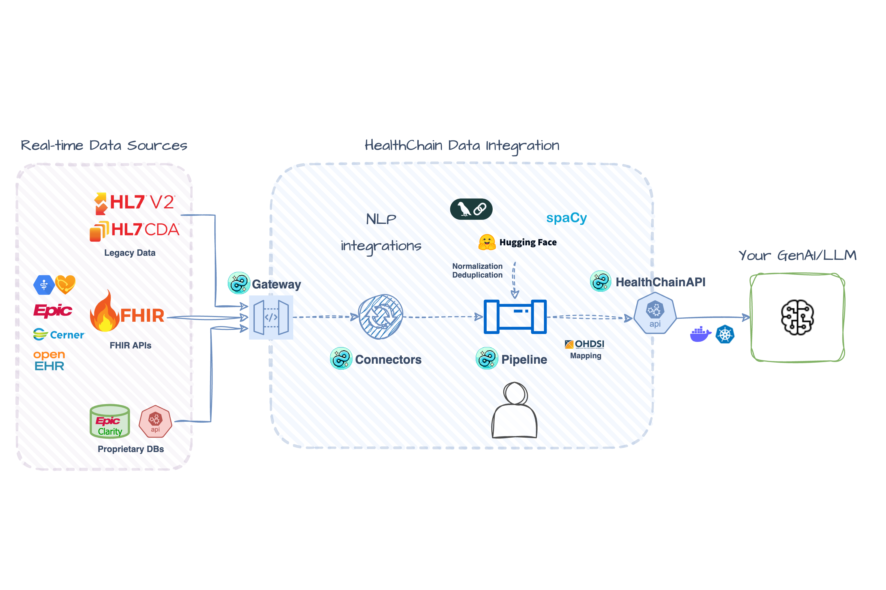

# Multi-Source Patient Data Aggregation

This example shows you how to aggregate patient data from multiple FHIR sources and track data provenance: essential for building AI applications that train on diverse data, query multiple EHR vendors in RAG systems, or construct unified patient timelines from fragmented health records.

Check out the full working example [here](https://github.com/dotimplement/HealthChain/tree/main/cookbook/multi_ehr_data_aggregation.py)!

 *Illustrative Architecture - actual implementation may vary.*

## Setup

```bash
pip install healthchain python-dotenv
```

We'll use Epic's public FHIR sandbox. If you haven't set up Epic sandbox access yet, see the [FHIR Sandbox Setup Guide](./setup_fhir_sandboxes.md#epic-on-fhir-sandbox) for detailed instructions.

Once you have your Epic credentials, configure them in a `.env` file:

```bash
# .env file
EPIC_BASE_URL=https://fhir.epic.com/interconnect-fhir-oauth/api/FHIR/R4
EPIC_CLIENT_ID=your_non_production_client_id
EPIC_CLIENT_SECRET_PATH=path/to/privatekey.pem
EPIC_TOKEN_URL=https://fhir.epic.com/interconnect-fhir-oauth/oauth2/token
EPIC_USE_JWT_ASSERTION=true
```

Load your Epic credentials from the `.env` file and create a connection string compatible with the FHIR gateway:

```python
from healthchain.gateway.clients import FHIRAuthConfig

config = FHIRAuthConfig.from_env("EPIC")
EPIC_URL = config.to_connection_string()
```

## Set Up FHIR Gateway

[FHIR Gateways](../reference/gateway/fhir_gateway.md) connect to external FHIR servers and handles authentication, connection pooling, and token refresh automatically. Add the Epic sandbox as a source:

```python
from healthchain.gateway import FHIRGateway

gateway = FHIRGateway()
gateway.add_source("epic", EPIC_URL)

# Optional: Add Cerner's public sandbox (no auth required)
CERNER_URL = "fhir://fhir-open.cerner.com/r4/ec2458f2-1e24-41c8-b71b-0e701af7583d"
gateway.add_source("cerner", CERNER_URL)

# You can add more sources:
# gateway.add_source("other source", fhir://url)
```

!!! note

    Cerner's public sandbox patient cohort differs from Epic's. For demo/testing with sandboxes, expect incomplete aggregation if patient cohorts don't overlap - this is normal for the public test data.

    In production, you must perform your own patient identity matching (MPI/crosswalk) before aggregation.


## Create Aggregation Handler

Define an aggregation handler that queries multiple FHIR sources for [Condition](https://www.hl7.org/fhir/condition.html) resources.

```python
from healthchain.fhir import merge_bundles

@gateway.aggregate(Condition)
def get_unified_patient(patient_id: str, sources: List[str]) -> Bundle:
    """Aggregate conditions from multiple FHIR sources with provenance tracking."""
    bundles = []
    for source in sources:
        try:
            bundle = gateway.search(
                Condition,
                {"patient": patient_id},
                source,
                add_provenance=True,  # Track which EHR the data came from
                provenance_tag="aggregated",
            )
            bundles.append(bundle)
        except Exception as e:
            print(f"Error from {source}: {e}")
            # Continue with partial data rather than fail completely

    # Combine conditions across sources
    merged_bundle = merge_bundles(bundles, deduplicate=True)
    return merged_bundle
```

!!! info "What this handler does"

    - Queries each configured FHIR source for patient conditions
    - Adds [Meta](https://hl7.org/fhir/resource.html#Meta) tags to track data provenance (which source each condition came from, preserves existing metadata)
    - Handles errors gracefully – partial data is better than no data
    - Deduplicates identical conditions across sources


??? example "Example FHIR Metadata"

    ```json
    {
      "resourceType": "Condition",
      "id": ...,
      "meta": {
        "lastUpdated": "2025-10-10T15:23:50.167941Z",  // Updated timestamp
        "source": "urn:healthchain:source:epic",  // Adds source
        "tag": [
          {
            "system": "https://dotimplement.github.io/HealthChain/fhir/tags",
            "code": "aggregated",
            "display": "Aggregated"
          }  // Appends a custom HealthChain tag
        ]
      }
      ...
    }
    ```

## Build the Service

Register the gateway with [HealthChainAPI](../reference/gateway/api.md) to create REST endpoints.

```python
import uvicorn
from healthchain.gateway import HealthChainAPI

app = HealthChainAPI()
app.register_gateway(gateway, path="/fhir")

uvicorn.run(app)
```

!!! tip "FHIR Endpoints Provided by the Service"

    - `/fhir/*` - Standard FHIR operations (`read`, `search`, `create`, `update`)
    - `/fhir/metadata` - [CapabilityStatement](https://hl7.org/fhir/capabilitystatement.html) describing supported resources and operations
    - `/fhir/status` - Operational status and metadata for gateway

## Add Processing Pipeline (Optional)

For additional processing like terminology mapping or quality checks, create a Document [Pipeline](../reference/pipeline/pipeline.md).

Document pipelines are optimized for text and structured data processing, such as FHIR resources. When you initialize a [Document](../reference/io/containers/document.md) with FHIR [Bundle](https://www.hl7.org/fhir/condition.html) data, it automatically extracts and separates metadata resources from the clinical resources for easier inspection and error handling:

```python
# Initialize Document with a Bundle
doc = Document(data=merged_bundle)

# OperationOutcomes are automatically extracted and available
doc.fhir.operation_outcomes  # List of OperationOutcome resources

# Clinical resources remain in the bundle
doc.fhir.bundle              # Bundle with clinical resources
doc.fhir.problem_list        # List of Condition resources
doc.fhir.medication_list     # List of MedicationStatement resources
```

Add processing nodes using decorators:

```python
from healthchain.pipeline import Pipeline
from healthchain.io.containers import Document

pipeline = Pipeline[Document]()

@pipeline.add_node
def deduplicate(doc: Document) -> Document:
  ...

@pipeline.add_node
def add_annotation(doc: Document) -> Document:
  ...

# Apply the pipeline
doc = Document(data=merged_bundle)
doc = pipeline(doc)
```

!!! tip "Common Pipeline Uses"

    - **Terminology mapping** (ICD-10 ↔ SNOMED CT)
    - **Data enrichment** (risk scores, clinical decision support)
    - **Quality checks** (validate completeness, flag inconsistencies)
    - **Consent filtering** (apply patient consent rules)


## Test the Service

To test aggregation, request `/fhir/aggregate/Condition/{patientId}` with the `sources` parameter (e.g., `epic,cerner`).

Example uses Epic patient `eIXesllypH3M9tAA5WdJftQ3`; see [Epic sandbox](https://fhir.epic.com/Documentation?docId=testpatients) for more test patients.


=== "cURL"
    ```bash
    curl -X 'GET' \
      'http://127.0.0.1:8888/fhir/aggregate/Condition?id=eIXesllypH3M9tAA5WdJftQ3&sources=epic&sources=cerner' \
      -H 'accept: application/fhir+json'
    ```

=== "Python"
    ```python
      import requests

      url = "http://127.0.0.1:8888/fhir/aggregate/Condition"
      params = {
          "id": "eIXesllypH3M9tAA5WdJftQ3",
          "sources": ["epic", "cerner"]
      }
      headers = {
          "accept": "application/fhir+json"
      }
      response = requests.get(url, headers=headers, params=params)
      print(response.json)
    ```


### Expected Outputs

Example output when querying Linda Ross (Epic patient `eIXesllypH3M9tAA5WdJftQ3`):

```
✓ Patient: Ross, Linda Jane
✓ Conditions retrieved: 2

Sample conditions:
  • Moderate persistent asthma
    Codes: ICD10-CM:J45.40, SNOMED:427295004, ICD9:493.90
    Source: urn:healthchain:source:epic
    Severity: Medium
    Onset: 1999-03-08

  • Bronchitis with asthma, acute
    Codes: ICD10-CM:J20.9/J45.909, SNOMED:405944004, ICD9:466.0
    Source: urn:healthchain:source:epic
    Severity: High
    Onset: 2019-05-24
```

???+ example "Aggregated Result: With provenance tags and pipeline processing"

    Sample Bundle with deduplicated Conditions aggregated from Epic and Cerner. Each includes source details (`meta.source`, `meta.tag`) and a pipeline-added `note`.

    ```json
    {
      "resourceType": "Bundle",
      "type": "collection",
      "entry": [
        {
          "resource": {
            "resourceType": "Condition",
            "id": "eOCME6XUbCLYmFlVf2l1G0w3",
            "meta": {
              "lastUpdated": "2025-10-10T15:23:50.167941Z",  // Updated by HealthChain Gateway
              "source": "urn:healthchain:source:epic",       // Added by HealthChain Gateway
              "tag": [{
                "system": "https://dotimplement.github.io/HealthChain/fhir/tags",
                "code": "aggregated",
                "display": "Aggregated"
              }]  // Added by HealthChain Gateway
            },
            "clinicalStatus": { "text": "Active" },
            "severity": { "text": "Medium" },
            "code": {
              "coding": [
                {
                  "system": "http://hl7.org/fhir/sid/icd-10-cm",
                  "code": "J45.40",
                  "display": "Moderate persistent asthma, uncomplicated"
                },
                {
                  "system": "http://snomed.info/sct",
                  "code": "427295004",
                  "display": "Moderate Persistent Asthma"
                },
                {
                  "system": "http://hl7.org/fhir/sid/icd-9-cm",
                  "code": "493.90"
                }
              ],
              "text": "Moderate persistent asthma"
            },
            "subject": {
              "reference": "Patient/eIXesllypH3M9tAA5WdJftQ3",
              "display": "Ross, Linda Jane"
            },
            "onsetDateTime": "1999-03-08",
            "note": [{
              "text": "This resource has been processed by healthchain pipeline"
            }]  // Added by HealthChain Pipeline
          }
        },
        {
          "resource": {
            "resourceType": "Condition",
            "id": "etZVq9vWdHQ4q0Y6INaFhig3",
            "meta": {
              "lastUpdated": "2025-10-10T15:23:50.168175Z", // Updated by HealthChain Gateway
              "source": "urn:healthchain:source:epic",      // Added by HealthChain Gateway
              "tag": [{
                "system": "https://dotimplement.github.io/HealthChain/fhir/tags",
                "code": "aggregated"
              }]  // Added by HealthChain Gateway
            },
            "severity": { "text": "High" },
            "code": {
              "coding": [
                {
                  "system": "http://hl7.org/fhir/sid/icd-10-cm",
                  "code": "J20.9",
                  "display": "Acute bronchitis, unspecified"
                },
                {
                  "system": "http://snomed.info/sct",
                  "code": "405944004",
                  "display": "Asthmatic Bronchitis"
                }
              ],
              "text": "Bronchitis with asthma, acute"
            },
            "onsetDateTime": "2019-05-24",
            "note": [{
              "text": "This resource has been processed by healthchain pipeline"
            }]  // Added by HealthChain Pipeline
          }
        }
      ]
    }
    ```

??? warning "OperationOutcome: Authorization warnings"

    You'll see this if you haven't authorized access to the correct FHIR resources when you set up your FHIR sandbox.

    ```python
    print([outcome.model_dump() for outcome in doc.fhir.operation_outcomes])
    ```

    ```json
    {
      "resourceType": "OperationOutcome",
      "meta": {
        "source": "urn:healthchain:source:epic"
      },
      "issue": [
        {
          "severity": "warning",
          "code": "suppressed",
          "details": {
            "coding": [{
              "system": "urn:oid:1.2.840.114350.1.13.0.1.7.2.657369",
              "code": "59204"
            }]
          },
          "diagnostics": "Client not authorized for Condition - Encounter Diagnosis"
        },
        {
          "severity": "warning",
          "code": "suppressed",
          "diagnostics": "Client not authorized for Condition - Health Concerns"
        },
        {
          "severity": "warning",
          "code": "suppressed",
          "diagnostics": "Client not authorized for Condition - Medical History"
        }
      ]
    }
    ```

??? warning "Expected Error Handling"

    You'll see this when querying a patient that doesn't exist in a source:

    ```
    Error from cerner: [FHIR request failed: 400 - Unknown error]
    search <class 'fhir.resources.condition.Condition'> failed:
    Resource could not be parsed or failed basic FHIR validation rules
    ```


## What You've Built

A production-ready data aggregation service with:

- **Multi-vendor support** - Query Epic, Cerner, and other FHIR sources simultaneously
- **Automatic provenance tracking** - `meta.source` field shows which EHR each resource came from
- **Error resilience** - Handles missing patients, network failures, auth issues gracefully
- **Deduplication** - Merges identical conditions across sources
- **Pipeline extensibility** - Add custom processing for terminology mapping, NLP, or quality checks

!!! info "Use Cases"

    - **Data Harmonization**: Use pipelines to normalize terminology (ICD-10 ↔ SNOMED CT), validate completeness, and flag inconsistencies across sources. Combine with clinical NLP engines to extract and aggregate data from unstructured clinical notes alongside structured FHIR resources.

    - **RAG Systems**: Build retrieval systems that search across multiple health systems. The aggregator provides the unified patient context LLMs need for clinical reasoning.

    - **Training Data for AI Models**: Aggregate diverse patient data across EHR vendors for model training. Provenance tags enable stratified analysis (e.g., "how does model performance vary by data source?").

!!! tip "Next Steps"

    - **Try another FHIR server**: Set up a different [FHIR server](./setup_fhir_sandboxes.md) where you can upload the same test patients to multiple instances for true multi-source aggregation.
    - **Expand resource types**: Change `Condition` to `MedicationStatement`, `Observation`, or `Procedure` to aggregate different data.
    - **Add processing**: Extend the pipeline with terminology mapping, entity extraction, or quality checks.
    - **Build on it**: Use aggregated data in the [Clinical Coding tutorial](./clinical_coding.md) or feed it to your LLM application.
