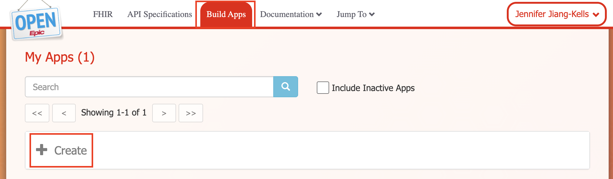

# Working with FHIR Sandboxes

This guide covers setting up access to public FHIR sandboxes for testing and development. These sandboxes provide free access to test data and realistic FHIR APIs without requiring production EHR credentials.

## Epic on FHIR Sandbox

Epic provides a public [testing sandbox](https://open.epic.com/MyApps/Endpoints) with [sample patients](https://fhir.epic.com/Documentation?docId=testpatients) and [resource specifications available](https://fhir.epic.com/Specifications) for developing against their FHIR Server.

### Prerequisites

- Free Epic on FHIR developer account: [https://fhir.epic.com/](https://fhir.epic.com/)
- No existing Epic customer account required (it only takes a minute)

### Step 1: Create an App

1. Log in to [https://fhir.epic.com/](https://fhir.epic.com/)


2. Navigate to "Build Apps" → "Create"



3. Fill out the application form:
   - **Application Name**: Choose any descriptive name
   - **Application Type**: Check "Backend Systems"
   - **FHIR APIs**: Select the APIs you need (note the versions)


### Step 2: Configure OAuth2 with JWT Authentication

Epic uses [OAuth2 with JWT assertion for authentication](https://fhir.epic.com/Documentation?docId=oauth2&section=BackendOAuth2Guide).

#### Generate Key Pair

Follow Epic's instructions to [create a Public Private key pair for JWT signature](https://fhir.epic.com/Documentation?docId=oauth2&section=Creating-Key-Pair):

```bash
# Generate private key - make sure the key length is at least 2048 bits.
openssl genrsa -out privatekey.pem 2048

# Export public key as base64 encoded X.509 certificate
openssl req -new -x509 -key privatekey.pem -out publickey509.pem -subj '/CN=myapp'
```

Where `/CN=myapp` is the subject name (e.g., your app name). The subject name doesn't have functional impact but is required for creating an X.509 certificate.

#### Upload Public Key

1. In your Epic app configuration, upload the `publickey509.pem` file
2. Click **Save**
3. Note down your **Non-Production Client ID**


### Step 3: Complete App Setup

1. Fill out remaining required fields (description, etc.)
2. Check to confirm terms of use
3. Click **Save & Ready for Sandbox**


### Step 4: Configure Environment Variables

Create a `.env` file with your credentials:

```bash
# .env file
EPIC_BASE_URL=https://fhir.epic.com/interconnect-fhir-oauth/api/FHIR/R4
EPIC_CLIENT_ID=your_non_production_client_id
EPIC_CLIENT_SECRET_PATH=path/to/privatekey.pem
EPIC_TOKEN_URL=https://fhir.epic.com/interconnect-fhir-oauth/oauth2/token
EPIC_USE_JWT_ASSERTION=true
```

### Using Epic Sandbox in Code

```python
from healthchain.gateway.clients import FHIRAuthConfig

# Load configuration from environment variables
config = FHIRAuthConfig.from_env("EPIC")
EPIC_URL = config.to_connection_string()

# Add to FHIR gateway
from healthchain.gateway import FHIRGateway

gateway = FHIRGateway()
gateway.add_source("epic", EPIC_URL)
```

### Available Test Patients

Epic provides [sample test patients](https://fhir.epic.com/Documentation?docId=testpatients) including:

- **Derrick Lin** - Patient ID: `eq081-VQEgP8drUUqCWzHfw3`
- **Linda Ross** - Patient ID: `eIXesllypH3M9tAA5WdJftQ3`
- Many others with various clinical scenarios

---
## Cerner Sandbox

Cerner (now Oracle Health) provides both open and secure public sandboxes for the [FHIR R4 APIs for Oracle Health Millennium Platform](https://docs.oracle.com/en/industries/health/millennium-platform-apis/mfrap/srv_root_url.html).

The Open Sandbox is read-only. It does not require authentication and is handy for quick proof of concepts:

```bash
https://fhir-open.cerner.com/r4/ec2458f2-1e24-41c8-b71b-0e701af7583d/:resource[?:parameters]
```
You can get an idea of patients available in the open sandbox by querying some common last names:

```bash
curl -i -H "Accept: application/json+fhir" "https://fhir-open.cerner.com/r4/ec2458f2-1e24-41c8-b71b-0e701af7583d/Patient?family=smith"
```

Documentation on Secure Sandbox coming soon.

---
## Medplum

[Medplum](https://www.medplum.com/) is an open-source healthcare platform that provides a compliant FHIR server. It's useful for testing with controlled data where you can upload your own test patients. Medplum uses [standard OAuth2/OpenID authentication](https://www.medplum.com/docs/auth/client-credentials).

### Prerequisites

- Medplum account: [Register here](https://www.medplum.com/docs/tutorials/register)
- Free tier available

### Step 1: Create a Client Application

1. Log in to your Medplum account
2. Navigate to [ClientApplication](https://app.medplum.com/ClientApplication)
3. Create a new Client and configure Access Policy if needed.


### Step 2: Get Credentials

After creating the client:

1. Note your **Client ID**
2. Copy your **Client Secret**


### Step 3: Configure Environment Variables

Create a `.env` file with your credentials:

```bash
# .env file
MEDPLUM_BASE_URL=https://api.medplum.com/fhir/R4
MEDPLUM_CLIENT_ID=your_client_id
MEDPLUM_CLIENT_SECRET=your_client_secret
MEDPLUM_TOKEN_URL=https://api.medplum.com/oauth2/token
MEDPLUM_SCOPE=openid
```

### Using Medplum in Code

```python
from healthchain.gateway import FHIRGateway
from healthchain.gateway.clients import FHIRAuthConfig
from dotenv import load_dotenv

load_dotenv()

# Load configuration from environment variables
config = FHIRAuthConfig.from_env("MEDPLUM")
MEDPLUM_URL = config.to_connection_string()

# Add to FHIR gateway
gateway = FHIRGateway()
gateway.add_source("medplum", MEDPLUM_URL)
```

### Benefits of Medplum

- **Full control**: Upload your own test data
- **FHIR R4 compliant**: Complete FHIR API implementation
- **Multi-source testing**: Create multiple projects for different data sources
- **Web interface**: Browse and manage resources via UI

---
## Tips for Multi-Source Testing

### Different Test Data

Public sandboxes (Epic, Cerner) contain different test patients. When testing multi-source aggregation:

- **Expected behavior**: Queries for patients not in a source should fail gracefully
- **Production use**: Map patient identifiers across systems or use sources sharing patient cohorts
- **Controlled testing**: Use Medplum where you can upload the same test patients to multiple instances

### Error Handling

Your code should handle:

- Network issues or downtime
- Patient not found in specific sources
- Rate limiting
- Authorization failures

### Authentication

| Sandbox   | Auth Mechanism                      |
|-----------|------------------------------------|
| **Epic**  | OAuth2 with JWT assertion (backend) |
| **Medplum** | OAuth2 client credentials (Client Credentials Flow) |


HealthChain's [FHIRGateway](../reference/gateway/fhir_gateway.md) handles these automatically via connection strings.

## Next Steps

- Return to your tutorial to continue with the specific use case
- See [FHIR Gateway documentation](../reference/gateway/fhir_gateway.md) for advanced configuration
- Check [FHIR Resources documentation](https://www.hl7.org/fhir/) for working with different resource types
