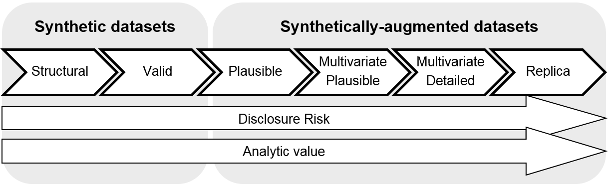

# Quickstart

## Core Components

### Sandbox
A sandbox is a HL7 standard-compliant client-to-service full pipeline test environment. For a given sandbox run:

1. Data is generated or loaded into a client (EHR)

2. Data is wrapped and sent as standard-compliant API requests the designated service

3. Data is processed by the service

4. Processed result is wrapped and sent back to the service as standard-compliant API Response

5. Data is received by the client and rendered in a UI interface

To declare a sandbox, create a class that inherits from a type of `UseCase` and decorate it with the `@hc.sandbox` decorator.

Note that both **must** be present for a valid sandbox declaration: `UseCase` loads in the blueprint of the service, client, and APIs used, and `@hc.sandbox` orchestrates these interactions.

```python
import healthchain as hc

from healthchain.use_cases import ClinicalDecisionSupport

@hc.sandbox
class MyCoolSandbox(ClinicalDecisionSupport):
    def __init__(self) -> None:
        pass
```

In this example, naming our class `MyCoolSandbox`, telling it to behave like a clinical decision support system (based on CDS Hooks), and declaring it should be run in a sandbox.

Every sandbox requires a client and a server.

!!! success "Sandbox Essentials"

    - `UseCase` from which the sandbox class inherits from
    - service function
    - client function

### Client
A client is a healthcare system object that requests information and processing from an external service.

A client is typically an EHR system, but we may also support other health objects in the future such as a CPOE (Computerized Ohysician Order Entry).

We can mark a client by using the decorator `@hc.ehr`. You **must** declare a **workflow** for EHR clients, which informs the sandbox how your data will be formatted (See [Use Cases](/usecases)).

You can optionally specify if you want more than 1 request generated with the `num` parameter.

```python
import healthchain as hc
from healthchain.use_cases import ClinicalDecisionSupport

@hc.sandbox
class MyCoolSandbox(ClinicalDecisionSupport):
    def __init__(self) -> None:
        pass

    @hc.ehr(workflow="patient-view", num=10)
    def load_data_in_client(self):
        # Do things here to load in your data
        pass

```


### Data Generator
Healthcare data is interoperable, but not composable - every deployment site will have different ways of configuring data and terminology. This matters when you develop applications that need to integrate into these systems, especially when you need to reliably extract data for your model to consume.

The aim of the Data Generator is not to generate realistic data suitable for use cases such as patient population studies, but rather to generate data that is structurally compliant with what is expected of EHR configurations, and to be able to test and handle variations in this.

For this reason the data generator is opiniated by use case and workflow. See [Use Cases](usecases.md).

!!! note
    We're aware we may not cover everyone's use cases, so if you have strong opinions about this, please [reach out](https://discord.gg/jG4UWCUh)!

On the synthetic data spectrum defined by [this UK ONS methodology working paper](https://www.ons.gov.uk/methodology/methodologicalpublications/generalmethodology/onsworkingpaperseries/onsmethodologyworkingpaperseriesnumber16syntheticdatapilot#:~:text=Synthetic%20data%20at%20ONS&text=Synthetic%20data%20is%20created%20by,that%20provided%20the%20original%20data.%E2%80%9D), HealthChain generates level 1: synthetic structural data.



You can use the data generator within a Client function or on its own. The `.data` attribute contains a Pydantic class containing `context` and `resources`.

=== "Within client"
    ```python
    import healthchain as hc
    from healthchain.data_generator import DataGenerator
    from healthchain.use_cases import ClinicalDecisionSupport

    @hc.sandbox
    class MyCoolSandbox(ClinicalDecisionSupport):
        def __init__(self) -> None:
            self.data_generator = DataGenerator()

        @hc.ehr(workflow="patient-view")
        def load_data_in_client(self):
            self.data_generator.generate()
            return self.data_generator.data

        @hc.api
        def my_server(self, text):
            pass
    ```


=== "On its own"
    ```python
    from healthchain.data_generator import DataGenerator
    from healthchain.base import Workflow

    # Initialise data generator
    data_generator = DataGenerator()

    # Generate FHIR resources for use case workflow
    data_generator.set_workflow(Workflow.encounter_discharge)
    data_generator.generate()

    print(data_generator.data.resources.model_dump(by_alias=True, exclude_unset=True))
    ```

<!-- You can pass in parameters in `contraint` argument to limit the general form of the FHIR resources you get back, but this feature is experimental. Arguments supported are:
- `"has_medication_request"`
- `"has_problem_list"`
- `"has_procedures"`
- `"long_encounter_period"`

```python
data_generator.generate(constrain=["has_medication_requests"])
```
-->

#### Other synthetic data sources

If you are looking for realistic datasets, you are also free to load your own data in a sandbox run! Check out [MIMIC](https://mimic.mit.edu/) for comprehensive continuity of care records and free-text data, or [Synthea](https://synthetichealth.github.io/synthea/) for synthetically generated FHIR resources. Both are open-source, although you will need to complete [PhysioNet Credentialing](https://mimic.mit.edu/docs/gettingstarted/) to access MIMIC.

#### Loading free-text

You can specify the `free_text_csv` field of the `.generate()` method to load in free-text sources into the data generator, e.g. discharge summaries. This will wrap the text into a FHIR [DocumentReference](https://build.fhir.org/documentreference.html) resource (N.B. currently we place the text directly in the resource attachment, although it is technically supposed to be base64 encoded).

A random text document from the `csv` file will be picked for each generation.

```python
# Load free text into a DocumentResource FHIR resource
data_generator.generate(free_text_csv="./dir/to/csv/file")
```


### Service API
A service is typically an API of an external AI/NLP system that returns data to the client. This is where you define your application logic - it can be anything from a simple regex to a highly sophisticated LLM agentic workflow. The only constraint is that you have to return your data as a `Dict` that your workflow expects.

When you decorate a function with `@hc.api` in a sandbox, the function is mounted to a HL7-compliant service endpoint an EHR client can make requests to. This is usually a set of standardised API routes depending on the use case. HealthChain will start a [FastAPI](https://fastapi.tiangolo.com/) server with these APIs pre-defined for you.

If you are using a model that requires initialisation steps, we recommend you initialise this in your class `__init__`.

=== "Transformers"
    ```bash
    pip install torch transformers
    ```
    ```python
    import healthchain as hc

    from healthchain.use_cases import ClinicalDecisionSupport
    from healthchain.data_generator import DataGenerator
    from transformers import pipeline

    from typing import Dict

    @hc.sandbox
    class MyCoolSandbox(ClinicalDecisionSupport):
        def __init__(self):
            self.data_generator = DataGenerator()
            self.pipeline = pipeline('summarization')

        @hc.api
        def my_service(self, text: str):
            results = self.pipeline(text)
            return {
                "cards": [
                    {
                        "summary": "Patient summary",
                        "indicator": "info",
                        "source": {"label": "transformer"},
                        "detail": results[0]['summary_text']
                    }
                ]
            }

        @hc.ehr(workflow="patient-view")
        def load_data_in_client(self):
            self.data_generator.generate()
            return self.data_generator.data
    ```
=== "LLM (OpenAI)"
    ```bash
    pip install langchain langchain-openai
    ```
    ```python
    import healthchain as hc

    from healthchain.use_cases import ClinicalDecisionSupport
    from healthchain.data_generator import DataGenerator

    from langchain_openai import ChatOpenAI
    from langchain_core.prompts import PromptTemplate
    from langchain_core.output_parsers import StrOutputParser

    from typing import Dict

    @hc.sandbox
    class MyCoolSandbox(ClinicalDecisionSupport):
        def __init__(self):
            self.chain = self._init_llm_chain()
            self.data_generator = DataGenerator()

        def _init_llm_chain(self):
            prompt = PromptTemplate.from_template(
                "Summarize the text below {text}"
                )
            model = ChatOpenAI(model="gpt-4o")
            parser = StrOutputParser()

            chain = prompt | model | parser

            return chain

        @hc.api
        def my_service(self, text: str) -> Dict:
            result = self.chain.invoke(text)
            return {
                "cards": [
                    {
                        "summary": "Patient summary",
                        "indicator": "info",
                        "source": {"label": "openai"},
                        "detail": result
                    }
                ]
            }

        @hc.ehr(workflow="patient-view")
        def load_data_in_client(self):
            self.data_generator.generate()
            return self.data_generator.data
    ```


## Full Example

```python
import healthchain as hc

from healthchain.use_cases import ClinicalDecisionSupport
from healthchain.data_generator import DataGenerator

from typing import Dict

@hc.sandbox
class MyCoolSandbox(ClinicalDecisionSupport):
    def __init__(self) -> None:
        self.data_generator = DataGenerator()

    @hc.ehr(workflow="encounter-discharge", num=10)
    def load_data_in_client(self):
        self.data_generator.generate(
            free_text_csv="/example_discharge_summaries.csv"
            )
        return self.data_generator.data

    @hc.api
    def llm_server(self, text: str) -> Dict:
        return {
            "cards": [
                {
                    "summary": "This will be generated by your model",
                    "indicator": "info",
                    "source": {"label": "resource"},
                }
            ]
        }

if __name__ == "__main__":
    cds = MyCoolSandbox()
    cds.start_sandbox()

```


## Deploy sandbox locally with FastAPI 🚀

To run your sandbox:

```bash
healthchain run my_sandbox.py
```

This will start a server by default at `http://127.0.0.1:8000`, and you can interact with the exposed endpoints at `/docs`. Data generated from your sandbox runs is saved at `./output/` by default.

## Inspect generated data in Streamlit 🎈
The streamlit dashboard is run separately and is currently purely for visualisation purposes.

To run the streamlit app:

```bash
cd streamlist_demo
streamlit run app.py
```
