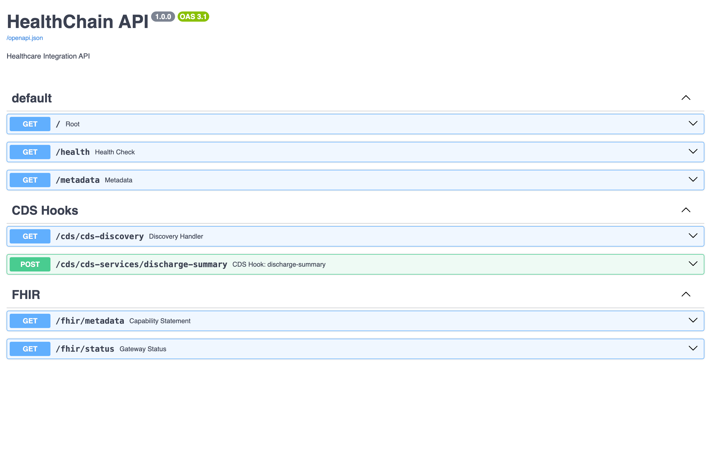

# HealthChainAPI 🏥

The `HealthChainAPI` is your main application that coordinates all the different gateways and services.

It's a [FastAPI](https://fastapi.tiangolo.com/) app under the hood, so you get all the benefits of FastAPI (automatic docs, type safety, performance) plus healthcare-specific features that makes it easier to work with healthcare data sources, such as FHIR APIs, CDS Hooks, and SOAP/CDA services.


## Basic Usage


```python
from healthchain.gateway import HealthChainAPI, FHIRGateway
import uvicorn

# Create your app
app = HealthChainAPI(
    title="My Healthcare App",
    description="AI-powered patient care",
)

# Add a FHIR gateway
fhir = FHIRGateway()
app.register_gateway(fhir)

# Run it (docs automatically available at /docs)
if __name__ == "__main__":
    uvicorn.run(app)
```

You can also register multiple services of different protocols:

```python
from healthchain.gateway import (
    HealthChainAPI, FHIRGateway,
    CDSHooksService, NoteReaderService
)

app = HealthChainAPI()

# Register everything you need
app.register_gateway(FHIRGateway(), path="/fhir")
app.register_service(CDSHooksService(), path="/cds")
app.register_service(NoteReaderService(), path="/soap")

# Your API now handles:
# /fhir/* - Patient data, observations, etc.
# /cds/* - Real-time clinical alerts
# /soap/* - Clinical document processing
```

## Default Endpoints



The HealthChainAPI automatically provides several default endpoints:

### Root Endpoint: `GET /`

Returns basic API information and registered components.

```json
{
  "name": "HealthChain API",
  "version": "1.0.0",
  "description": "Healthcare Integration Platform",
  "gateways": ["FHIRGateway"],
  "services": ["CDSHooksService", "NoteReaderService"]
}
```

### Health Check: `GET /health`

Simple health check endpoint for monitoring.

```json
{
  "status": "healthy"
}
```

### Gateway Status: `GET /gateway/status`

Comprehensive status of all registered gateways and services.

```json
{
  "gateways": {
    "FHIRGateway": {
      "status": "active",
      "sources": ["epic", "cerner"],
      "connection_pool": {...}
    }
  },
  "services": {
    "CDSHooksService": {
      "status": "active",
      "hooks": ["patient-view", "order-select"]
    }
  },
  "events": {
    "enabled": true,
    "dispatcher": "LocalEventDispatcher"
  }
}
```


## Event Integration

The HealthChainAPI coordinates events across all registered components. This is useful for auditing, workflow automation, and other use cases. For more information, see the **[Events](events.md)** page.


```python
from healthchain.gateway.events.dispatcher import local_handler

app = HealthChainAPI()

# Register global event handler
@local_handler.register(event_name="fhir.patient.read")
async def log_patient_access(event):
    event_name, payload = event
    print(f"Patient accessed: {payload['resource_id']}")

# Register handler for all events from specific component
@local_handler.register(event_name="cdshooks.*")
async def log_cds_events(event):
    event_name, payload = event
    print(f"CDS Hook fired: {event_name}")
```

## Dependencies and Injection

The HealthChainAPI provides dependency injection for accessing registered components.

### Gateway Dependencies

```python
from healthchain.gateway.api.dependencies import get_gateway
from fastapi import Depends

@app.get("/custom/patient/{id}")
async def get_enhanced_patient(
    id: str,
    fhir: FHIRGateway = Depends(get_gateway("FHIRGateway"))
):
    """Custom endpoint using FHIR gateway dependency."""
    patient = await fhir.read(Patient, id)
    return patient

# Or get all gateways
from healthchain.gateway.api.dependencies import get_all_gateways

@app.get("/admin/gateways")
async def list_gateways(
    gateways: Dict[str, Any] = Depends(get_all_gateways)
):
    return {"gateways": list(gateways.keys())}
```

### Application Dependencies

```python
from healthchain.gateway.api.dependencies import get_app

@app.get("/admin/status")
async def admin_status(
    app_instance: HealthChainAPI = Depends(get_app)
):
    return {
        "gateways": len(app_instance.gateways),
        "services": len(app_instance.services),
        "events_enabled": app_instance.enable_events
    }
```


## See Also

- **[FHIR Gateway](fhir_gateway.md)**: Complete FHIR operations reference
- **[CDS Hooks Service](cdshooks.md)**: Complete CDS Hooks service reference
- **[NoteReader Service](soap_cda.md)**: Complete NoteReader service reference
