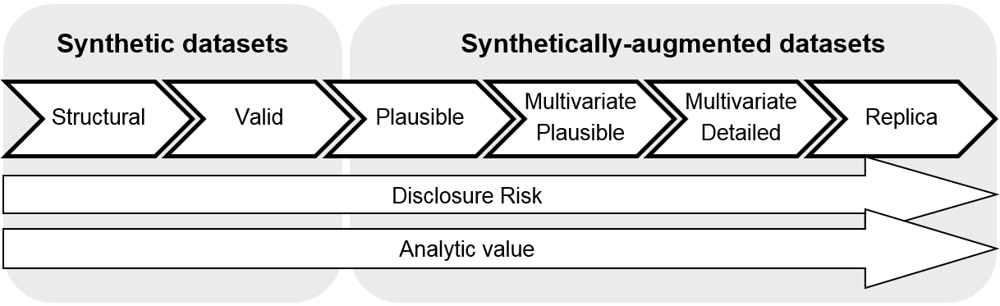

# Data Generator

Healthcare systems use standardized data formats, but each hospital or clinic configures their data differently. This creates challenges when building applications that need to work across multiple healthcare systems.

The data generator creates test data that matches the structure and format expected by Electronic Health Record (EHR) systems. It's designed for testing your applications, not for research studies that need realistic patient populations.

According to the [UK ONS synthetic data classification](https://www.ons.gov.uk/methodology/methodologicalpublications/generalmethodology/onsworkingpaperseries/onsmethodologyworkingpaperseriesnumber16syntheticdatapilot#:~:text=Synthetic%20data%20at%20ONS&text=Synthetic%20data%20is%20created%20by,that%20provided%20the%20original%20data.%E2%80%9D), HealthChain generates "level 1: synthetic structural data" - data that follows the correct format but contains fictional information.



## CDS Data Generator

The `.generate_prefetch()` method will return a dictionary of resources. Each key in the dictionary corresponds to a FHIR resource type, and the value is a list of FHIR resources or a Bundle of that type. For more information, check out the [CDS Hooks documentation](https://cds-hooks.org/specification/current/#providing-fhir-resources-to-a-cds-service).

For each workflow, a pre-configured list of FHIR resources is randomly generated and placed in the `prefetch` field of a `CDSRequest`.

Current implemented workflows:

| Workflow      | Implementation Completeness        | Generated Synthetic Resources |
| ----------- | ------------------------------------ | -----------------------------
| [patient-view](https://cds-hooks.org/hooks/patient-view/) | :material-check-all:  | `Patient`, `Encounter` (Future: `MedicationStatement`, `AllergyIntolerance`)|
| [encounter-discharge](https://cds-hooks.org/hooks/encounter-discharge/)| :material-check-all: | `Patient`, `Encounter`, `Procedure`, `MedicationRequest`, Optional `DocumentReference` |
| [order-sign](https://cds-hooks.org/hooks/order-sign/)| :material-check: Partial | Future: `MedicationRequest`, `ProcedureRequest`, `ServiceRequest` |
| [order-select](https://cds-hooks.org/hooks/order-select/) | :material-check: Partial | Future: `MedicationRequest`, `ProcedureRequest`, `ServiceRequest` |

For more information on CDS workflows, see the [CDS Hooks Protocol](../gateway/cdshooks.md) documentation.

You can use the data generator with `SandboxClient.load_free_text()` or standalone:

=== "With SandboxClient"
    ```python
    from healthchain.sandbox import SandboxClient

    # Create client
    client = SandboxClient(
        url="http://localhost:8000/cds/cds-services/my-service",
        workflow="encounter-discharge"
    )

    # Generate FHIR data from clinical notes
    client.load_free_text(
        csv_path="./data/discharge_notes.csv",
        column_name="text",
        random_seed=42
    )

    responses = client.send_requests()
    ```


=== "Standalone"
    ```python
    from healthchain.sandbox.generators import CdsDataGenerator
    from healthchain.sandbox.workflows import Workflow

    # Initialize data generator
    data_generator = CdsDataGenerator()

    # Generate FHIR resources for use case workflow
    data_generator.set_workflow(Workflow.encounter_discharge)
    prefetch = data_generator.generate_prefetch()

    print(prefetch.model_dump())

    # {
    #    "prefetch": {
    #        "encounter":
    #            {
    #              "resourceType": ...
    #            }
    #    }
    #}
    ```

<!-- You can pass in parameters in `contraint` argument to limit the general form of the FHIR resources you get back, but this feature is experimental. Arguments supported are:
- `"has_medication_request"`
- `"has_problem_list"`
- `"has_procedures"`
- `"long_encounter_period"`

```python
data_generator.generate(constrain=["has_medication_requests"])
```
-->

## Loading free-text

You can specify the `free_text_csv` field of the `.generate_prefetch()` method to load in free-text sources into the data generator, e.g. discharge summaries. This will wrap the text into a FHIR [DocumentReference](https://build.fhir.org/documentreference.html) resource (N.B. currently we place the text directly in the resource attachment, although it is technically supposed to be base64 encoded).

A random text document from the `csv` file will be picked for each generation.

```python
# Load free text into a DocumentResource FHIR resource
data = data_generator.generate_prefetch(free_text_csv="./dir/to/csv/file")
```
